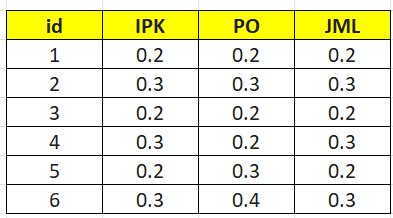

---
jupytext:
  formats: md:myst
  text_representation:
    extension: .md
    format_name: myst
    format_version: 0.13
    jupytext_version: 1.11.5
kernelspec:
  display_name: Python 3
  language: python
  name: python3
---

## Decimal Scaling

Decimal Scaling merupakan salah satu teknik normalisasi data yang digunakan untuk memperkecil nilai dari suatu atribut numerik dengan cara menggeser titik desimal pada nilai tersebut. Metode ini dilakukan dengan membagi nilai data dengan pangkat sepuluh sehingga nilai maksimum dari data hasil normalisasi memiliki nilai absolut kurang dari 1.

Metode ini sering digunakan dalam tahap **preprocessing data** pada data mining dan machine learning. Tujuannya adalah agar setiap atribut memiliki skala nilai yang lebih kecil dan seragam sehingga algoritma analisis data dapat bekerja lebih stabil dan akurat.

Normalisasi dengan metode Decimal Scaling dilakukan dengan membagi setiap nilai pada atribut dengan nilai **10 pangkat j**, dimana nilai **j** ditentukan berdasarkan jumlah digit dari nilai absolut terbesar pada atribut tersebut.

Rumus Decimal Scaling adalah sebagai berikut:

$$
v' = \frac{v}{10^j}
$$

Keterangan:

- $v'$ : Nilai baru setelah dinormalisasi  
- $v$ : Nilai asli dari data  
- $j$ : Bilangan bulat terkecil sehingga nilai absolut maksimum dari hasil normalisasi lebih kecil dari 1

---

## Contoh Data

Berikut contoh dataset yang akan digunakan untuk proses normalisasi.

| No. | IPK |   PO  | JML |
|:---:|:---:|:-----:|:---:|
| 1 | 2 | 2000000 | 2 |
| 2 | 3 | 3000000 | 3 |
| 3 | 4 | 2000000 | 2 |
| 4 | 2 | 2000000 | 3 |
| 5 | 3 | 3000000 | 2 |
| 6 | 4 | 4000000 | 3 |

Pada contoh di atas akan dilakukan **Decimal Scaling pada kolom PO**.

Nilai terbesar pada kolom **PO** adalah:

```
4000000
```

Nilai tersebut memiliki **7 digit**, sehingga:

```
j = 7
```

Selanjutnya dihitung nilai **10^j**

```
10^7 = 10000000
```

---

## Proses Perhitungan Decimal Scaling

Perhitungan normalisasi dilakukan dengan cara membagi setiap nilai PO dengan **10^7**.

$$
v' = \frac{v}{10^j}
$$

Perhitungan:

$$
v1 = \frac{2000000}{10000000} = 0.2
$$

$$
v2 = \frac{3000000}{10000000} = 0.3
$$

$$
v3 = \frac{2000000}{10000000} = 0.2
$$

$$
v4 = \frac{2000000}{10000000} = 0.2
$$

$$
v5 = \frac{3000000}{10000000} = 0.3
$$

$$
v6 = \frac{4000000}{10000000} = 0.4
$$

Hasil dari normalisasi menunjukkan bahwa seluruh nilai sudah berada pada rentang **0 sampai 1**.

---

## Implementasi di Excel

Proses Decimal Scaling juga dapat dilakukan menggunakan Excel dengan cara:

1. Menentukan nilai maksimum dari suatu kolom
2. Menentukan jumlah digit dari nilai maksimum tersebut
3. Membagi seluruh nilai pada kolom dengan **10 pangkat jumlah digit**

Contoh implementasi dapat dilihat pada gambar berikut:



---

## Implementasi Decimal Scaling Menggunakan Python

Berikut adalah contoh implementasi Decimal Scaling menggunakan Python dengan bantuan library **Pandas** dan **NumPy**.

```{code-cell}
import pandas as pd
import numpy as np

# =========================
# 1. Menyiapkan Data
# =========================

data = {
    'No': [1, 2, 3, 4, 5, 6],
    'IPK': [2, 3, 4, 2, 3, 4],
    'PO': [2000000, 3000000, 2000000, 2000000, 3000000, 4000000],
    'JML': [2, 3, 2, 3, 2, 3]
}

df = pd.DataFrame(data)

print("DATA ASLI")
print(df)


# =========================
# 2. Proses Decimal Scaling
# =========================

cols_to_normalize = ['IPK', 'PO', 'JML']

df_scaled = df.copy()

for col in cols_to_normalize:

    # mencari nilai absolut terbesar
    max_abs_val = df[col].abs().max()

    # menentukan nilai j (jumlah digit)
    if max_abs_val != 0:
        j = len(str(int(max_abs_val)))
    else:
        j = 1

    # melakukan normalisasi
    df_scaled[f'Dec_{col}'] = df[col] / (10**j)

print("\nHASIL DECIMAL SCALING (SEMUA KOLOM)")
print(df_scaled)


# =========================
# 3. Contoh khusus kolom PO
# =========================

po_array = np.array(df['PO'])

max_val = np.max(np.abs(po_array))

j_po = len(str(int(max_val)))

po_scaled = po_array / (10**j_po)

print("\nNORMALISASI KHUSUS KOLOM PO")
print("Data PO Asli :", po_array)
print("Nilai j :", j_po)
print("Hasil Decimal Scaling :", po_scaled)
```

---


## Kesimpulan

Decimal Scaling merupakan metode normalisasi data yang sederhana namun cukup efektif untuk memperkecil skala nilai suatu atribut numerik. Metode ini dilakukan dengan membagi setiap nilai data dengan **10 pangkat jumlah digit dari nilai terbesar** pada atribut tersebut.

Dengan menggunakan metode ini, seluruh nilai data akan berada pada rentang yang lebih kecil sehingga mempermudah proses analisis data pada tahap berikutnya, terutama pada algoritma machine learning yang sensitif terhadap perbedaan skala data.