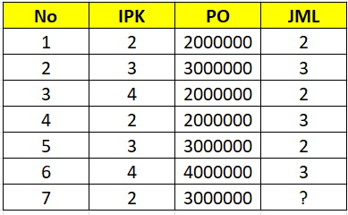
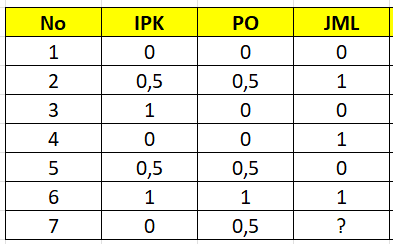

---
jupytext:
  formats: md:myst
  text_representation:
    extension: .md
    format_name: myst
    format_version: 0.13
    jupytext_version: 1.11.5
kernelspec:
  display_name: Python 3
  language: python
  name: python3
---

## Min-Max Normalization

Min-Max Normalization merupakan salah satu metode normalisasi data yang digunakan untuk mengubah skala nilai suatu atribut numerik ke dalam rentang tertentu. Biasanya rentang yang digunakan adalah **0 sampai 1**, namun dalam beberapa kasus juga dapat menggunakan rentang lain seperti **-1 sampai 1**.

Tujuan utama dari normalisasi ini adalah agar semua atribut memiliki skala yang sebanding. Dalam dataset sering ditemukan atribut yang memiliki rentang nilai sangat berbeda, misalnya satu atribut bernilai antara 1–5 sedangkan atribut lain bernilai ratusan ribu atau jutaan. Jika data tersebut langsung digunakan dalam perhitungan, maka atribut dengan nilai yang lebih besar dapat mendominasi hasil analisis.

Dengan menggunakan Min-Max Normalization, setiap nilai pada atribut akan ditransformasikan ke dalam rentang baru sehingga hubungan antar data tetap sama tetapi skalanya menjadi lebih kecil dan seragam.

Rumus Min-Max Normalization adalah sebagai berikut:

$$
v' = \frac{v - \min_A}{\max_A - \min_A} (\text{new_max}_A - \text{new_min}_A) + \text{new_min}_A
$$

Keterangan:

- $v$ : Nilai asli dari data  
- $v'$ : Nilai baru setelah dinormalisasi  
- $\min_A$ : Nilai minimum dari atribut $A$ pada data asli  
- $\max_A$ : Nilai maksimum dari atribut $A$ pada data asli  
- $\text{new_min}_A$ : Batas bawah dari rentang skala baru (biasanya 0)  
- $\text{new_max}_A$ : Batas atas dari rentang skala baru (biasanya 1)

Dalam praktik umum, normalisasi sering menggunakan bentuk sederhana dari rumus di atas ketika rentang yang digunakan adalah **0 sampai 1**, yaitu:

$$
x' = \frac{x - x_{min}}{x_{max} - x_{min}}
$$

---

## Contoh Data

Berikut merupakan contoh dataset yang akan digunakan untuk melakukan proses normalisasi.

| No. | IPK |   PO  | JML |
|:---:|:---:|:-----:|:---:|
|  1. |  2  |2000000|  2  |
|  2. |  3  |3000000|  3  |
|  3. |  4  |2000000|  2  |
|  4. |  2  |2000000|  3  |
|  5. |  3  |3000000|  2  |
|  6. |  4  |4000000|  3  |
|  7. |  2  |3000000|  ?  |



Pada dataset di atas akan dilakukan **Min-Max Normalization** pada kolom **IPK**, **PO**, dan **JML**.

---

## Contoh Perhitungan Manual

### Normalisasi IPK objek ke-2

$$
x' = \frac{3 - 2}{4 - 2} = \frac{1}{2} = 0.5
$$

### Normalisasi PO objek ke-2

$$
x' = \frac{3000000 - 2000000}{4000000 - 2000000} = \frac{1000000}{2000000} = 0.5
$$

### Normalisasi JML objek ke-2

$$
x' = \frac{3 - 2}{3 - 2} = \frac{1}{1} = 1
$$

---

## Hasil Setelah Normalisasi

Setelah seluruh data dinormalisasi menggunakan metode Min-Max, maka nilai-nilai pada dataset akan berada dalam rentang **0 sampai 1** seperti berikut.

| No. | IPK |   PO  | JML |
|:---:|:---:|:-----:|:---:|
|  1. |  0  |   0   |  0  |
|  2. | 0.5 |  0.5  |  1  |
|  3. |  1  |   0   |  0  |
|  4. |  0  |   0   |  1  |
|  5. | 0.5 |  0.5  |  0  |
|  6. |  1  |   1   |  1  |
|  7. |  0  |  0.5  |  ?  |



Normalisasi ini sangat penting terutama ketika dataset akan digunakan dalam metode **distance-based learning** seperti **KNN**, karena algoritma tersebut menghitung jarak antar data. Jika skala data tidak sama, maka atribut dengan nilai lebih besar dapat mempengaruhi hasil perhitungan jarak secara tidak proporsional.

---

## Implementasi Menggunakan Python

Berikut merupakan implementasi proses Min-Max Normalization menggunakan Python.

```{code-cell}
import pandas as pd

data = {
    'No': [1, 2, 3, 4, 5, 6],
    'IPK': [2, 3, 4, 2, 3, 4],
    'PO': [2000000, 3000000, 2000000, 2000000, 3000000, 4000000],
    'JML': [2, 3, 2, 3, 2, 3]
}

df = pd.DataFrame(data)

# Kolom yang akan dinormalisasi
cols_to_normalize = ['IPK', 'PO', 'JML']

# Membuat salinan data
df_normalized = df.copy()

for col in cols_to_normalize:
    
    # mencari nilai minimum dan maksimum
    min_val = df[col].min()
    max_val = df[col].max()
    
    # menerapkan rumus Min-Max Normalization
    df_normalized[col] = (df[col] - min_val) / (max_val - min_val)

print("Data Sebelum Normalisasi")
print(df)

print("\nData Setelah Normalisasi")
print(df_normalized)
```