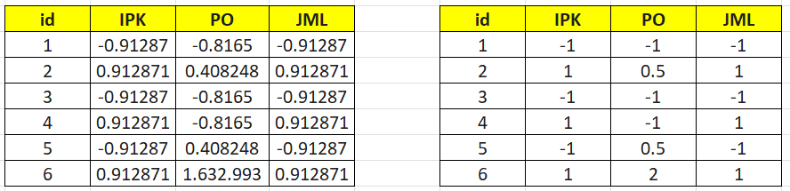

---
jupytext:
  formats: md:myst
  text_representation:
    extension: .md
    format_name: myst
    format_version: 0.13
    jupytext_version: 1.11.5
kernelspec:
  display_name: Python 3
  language: python
  name: python3
---

## Z-Score Normalization

Dalam beberapa kasus, normalisasi **Min-Max** tidak selalu cocok digunakan. Hal ini dapat terjadi ketika nilai minimum atau maksimum dari suatu atribut tidak diketahui, atau ketika dataset memiliki nilai ekstrem (outlier). Keberadaan outlier dapat menyebabkan normalisasi min-max menjadi kurang efektif karena nilai data lain akan terkonsentrasi pada rentang yang sangat sempit.

Untuk mengatasi kondisi tersebut, salah satu metode normalisasi yang sering digunakan adalah **Z-Score Normalization**. Metode ini melakukan standarisasi data dengan cara mengukur seberapa jauh suatu nilai terhadap nilai rata-rata dalam satuan **standar deviasi**.

Dengan menggunakan metode ini, data akan ditransformasikan sehingga memiliki:
- rata-rata (mean) = **0**
- standar deviasi = **1**

Rumus Z-Score Normalization adalah sebagai berikut:

$$
v' = \frac{v - \mu_A}{\sigma_A}
$$

Keterangan:

- $v'$ : Nilai baru setelah distandardisasi  
- $v$ : Nilai asli dari data  
- $\mu_A$ : Nilai rata-rata dari atribut $A$  
- $\sigma_A$ : Standar deviasi dari atribut $A$  

---

## Menghitung Rata-Rata

Rata-rata suatu atribut dihitung dengan rumus berikut:

$$
\bar{x} = \frac{1}{n} \sum_{i=1}^{n} x_i
$$

Keterangan:

- $n$ : jumlah data  
- $\sum$ : simbol penjumlahan seluruh data  
- $x_i$ : nilai data ke-i  

---

## Menghitung Standar Deviasi

Standar deviasi menunjukkan seberapa jauh penyebaran data dari rata-ratanya.

$$
\sigma_A = \sqrt{\frac{1}{n} \sum_{i=1}^{n} (v_i - \bar{A})^2}
$$

Keterangan:

- $\sigma_A$ : standar deviasi populasi  
- $v_i$ : nilai data ke-i  
- $\bar{A}$ : rata-rata atribut  

---

## Variasi Z-Score Menggunakan MAD

Selain menggunakan standar deviasi, terdapat variasi lain dari Z-Score yaitu menggunakan **Mean Absolute Deviation (MAD)**. Metode ini lebih **tahan terhadap outlier** karena tidak menggunakan kuadrat selisih nilai data.

Rumus Mean Absolute Deviation:

$$
s_A = \frac{1}{n} \sum_{i=1}^{n} |v_i - \bar{A}|
$$

Kemudian normalisasi menjadi:

$$
v' = \frac{v - A}{s_A}
$$

---

## Contoh Data

| No. | IPK |   PO  | JML |
|:---:|:---:|:-----:|:---:|
|  1. |  2  |2000000|  2  |
|  2. |  3  |3000000|  3  |
|  3. |  4  |2000000|  2  |
|  4. |  2  |2000000|  3  |
|  5. |  3  |3000000|  2  |
|  6. |  4  |4000000|  3  |

Pada contoh ini akan dilakukan **Z-Score Normalization** pada dataset tersebut.

---

## Contoh Perhitungan Standar Deviasi Kolom IPK

Nilai IPK = 2,3,4,2,3,4  
Mean = 3

$$
\sigma = \sqrt{\frac{1}{6}( (2-3)^2 + (3-3)^2 + (4-3)^2 + (2-3)^2 + (3-3)^2 + (4-3)^2 )}
$$

$$
\sigma = \sqrt{\frac{4}{6}} = 0.816497
$$



---

## Implementasi Menggunakan Python

Berikut implementasi **Z-Score Normalization menggunakan Standar Deviasi dan MAD** dalam Python.

```{code-cell}
import pandas as pd
import numpy as np

# Menyiapkan data
data = {
    'id': [1, 2, 3, 4, 5, 6],
    'IPK': [2, 3, 4, 2, 3, 4],
    'PO': [2000000, 3000000, 2000000, 2000000, 3000000, 4000000],
    'JML': [2, 3, 2, 3, 2, 3]
}

df = pd.DataFrame(data)

# Kolom yang akan dinormalisasi
kolom_target = ['IPK','PO','JML']

# =========================
# Z-Score menggunakan Standard Deviation
# =========================

df_stdev = df.copy()

for col in kolom_target:
    
    mean_val = df[col].mean()
    std_val = df[col].std(ddof=1)
    
    df_stdev[col] = (df[col] - mean_val) / std_val


# =========================
# Z-Score Variasi menggunakan MAD
# =========================

df_mad = df.copy()

for col in kolom_target:
    
    mean_val = df[col].mean()
    mad = (df[col] - mean_val).abs().mean()
    
    df_mad[col] = (df[col] - mean_val) / mad


# =========================
# Menampilkan hasil
# =========================

print("DATA ASLI")
print(df)

print("\nZ-SCORE MENGGUNAKAN STANDARD DEVIATION")
print(df_stdev.round(6))

print("\nZ-SCORE VARIASI MENGGUNAKAN MAD")
print(df_mad.round(2))
```