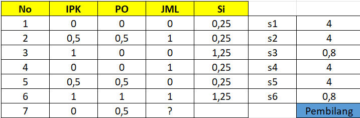
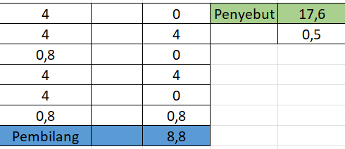

---
jupytext:
  formats: md:myst
  text_representation:
    extension: .md
    format_name: myst
    format_version: 0.13
    jupytext_version: 1.11.5
kernelspec:
  display_name: Python 3
  language: python
  name: python3
---

## WKNN
WKNN (*Weighted K-Nearest Neighbor*) merupakan pengembangan dari algoritma *K-Nearest Neighbors* (KNN) yang menggunakan konsep pembobotan pada setiap tetangga terdekat.

Pada metode ini, setiap data tetangga tidak memberikan pengaruh yang sama. Data yang memiliki jarak lebih dekat dengan data target akan diberikan bobot yang lebih besar dibandingkan data yang jaraknya lebih jauh. Dengan demikian, data yang lebih mirip akan memiliki kontribusi yang lebih besar dalam proses prediksi.

Metode imputasi menggunakan WKNN sering digunakan untuk mengisi nilai yang hilang (*missing value*) dalam dataset. Prosesnya dilakukan dengan mencari beberapa data yang paling dekat dengan data yang memiliki nilai kosong, kemudian memberikan bobot berdasarkan jaraknya untuk memperkirakan nilai yang hilang tersebut.

Contoh

| No. | IPK |   PO  | JML |
|:---:|:---:|:-----:|:---:|
|  1. |  2  |2000000|  2  |
|  2. |  3  |3000000|  3  |
|  3. |  4  |2000000|  2  |
|  4. |  2  |2000000|  3  |
|  5. |  3  |3000000|  2  |
|  6. |  4  |4000000|  3  |
|  7. |  2  |3000000|  ?  |


## Normalisasi
Pada dataset di atas terdapat satu nilai yang belum diketahui, yaitu pada objek ke-7 di kolom **JML**. Sebelum melakukan proses imputasi menggunakan metode WKNN, data terlebih dahulu perlu dinormalisasi agar seluruh atribut memiliki skala yang sama.

Pada contoh ini digunakan metode normalisasi **Min-Max Normalization**, yaitu metode yang mengubah nilai data ke dalam rentang 0 sampai 1. Dengan melakukan normalisasi, setiap atribut akan berada pada skala yang sebanding sehingga perhitungan jarak antar data dapat dilakukan dengan lebih adil.

Setelah dilakukan normalisasi, dataset akan berubah menjadi seperti tabel berikut.

| No. | IPK |   PO  | JML |
|:---:|:---:|:-----:|:---:|
|  1. |  0  |   0   |  0  |
|  2. | 0.5 |  0.5  |  1  |
|  3. |  1  |   0   |  0  |
|  4. |  0  |   0   |  1  |
|  5. | 0.5 |  0.5  |  0  |
|  6. |  1  |   1   |  1  |
|  7. |  0  |  0.5  |  ?  |


## Kemiripan
Setelah proses normalisasi selesai, langkah berikutnya adalah menghitung tingkat kemiripan atau kedekatan antara data yang memiliki *missing value* dengan data lainnya. Perhitungan ini didasarkan pada jarak antara baris data target dengan baris data tetangganya menggunakan rumus berikut.

$$
1/s_i = \sum_{h_i \in O_i \cap O_j} (y_{ih} - y_{jh})^2
$$

Dimana
- $(y_{ih} - y_{jh})^2$ = selisih kuadrat antara nilai atribut pada baris $i$ (data target) dengan baris $j$ (data tetangga). Perhitungan ini mirip dengan konsep pada **Euclidean Distance**.
- $O_i \cap O_j$ = penjumlahan hanya dilakukan pada atribut yang tersedia pada kedua data tersebut.
- $1/s_i$ = semakin kecil nilai jarak yang dihasilkan, maka nilai $s_i$ akan semakin besar yang berarti tingkat kemiripan antar data semakin tinggi.

Menghitung kemiripan objek pertama dan objek kedua pada objek ke-7

$$
1/s_i &= \sum_{h_i \in O_i \cap O_j} (y_{ih} - y_{jh})^2 \\
\\

1/s_1 &= (0-0)^2 + (0.5 - 0)^2 = 0 + 0.25 = 0.25\\
\\
1/0.25 &= 4\\
\\
s_1 &= 4\\
\\

1/s_2 &= (0 - 0.5)^2 + (0.5 - 0.5)^2 = 0.25 + 0 = 0.25\\
\\
1/0.25 &= 4\\
\\
s_2 &= 4
$$

Langkah yang sama dilakukan pada objek ke-3 hingga objek ke-6 sehingga diperoleh hasil sebagai berikut

$$
s_1 &= 4\\
s_2 &= 4\\
s_3 &= 0.8\\
s_4 &= 4\\
s_5 &= 4\\
s_6 &= 0.8
$$



## Imputasi
Setelah bobot ($s_i$) untuk setiap tetangga diperoleh, langkah selanjutnya adalah melakukan proses imputasi untuk mengisi nilai yang hilang dengan menggunakan rumus berikut.

$$
\hat{y}_{ih} = \frac{\sum_{j \in I_{Kih}} s_i(y_j) y_{jh}}{\sum_{j \in I_{Kih}} s_i(y_j)}
$$

Dimana
- $\hat{y}_{ih}$ adalah nilai prediksi yang dihasilkan untuk baris $i$ pada atribut $h$.
- $I_{Kih}$ merupakan himpunan dari $K$ tetangga terdekat yang memiliki nilai pada atribut tersebut.
- $s_i(y_j) y_{jh}$ adalah nilai dari tetangga ke-$j$ yang dikalikan dengan bobotnya sehingga tetangga yang lebih dekat memiliki pengaruh lebih besar.
- Penyebut ($\sum s_i$) digunakan untuk menormalkan bobot sehingga hasil akhir menjadi rata-rata tertimbang.

Jika rumus tersebut diterapkan pada dataset di atas, maka proses perhitungannya akan menghasilkan nilai sebagai berikut.

$$
\hat{y}_{ih} &= \frac{(0 \times 4)+(1 \times 4)+(0 \times 0.8)+(1 \times 4)+(0 \times 4)+(1 \times 0.8)} {4 + 4 + 0.8 + 4 + 4 + 0.8} \\ 
             \\
             &= \frac{0 + 4 + 0 + 4 + 0 + 0.8}{17.6}\\
             \\
             &= \frac{8.8}{17.6}\\
             \\
             &= 0.5
$$



Sehingga nilai prediksi untuk *missing value* menggunakan metode WKNN adalah **0.5**. Perhitungan tersebut jika diterapkan menggunakan Python akan menghasilkan kode berikut.

```{code-cell}
import pandas as pd
import numpy as np
from sklearn.preprocessing import MinMaxScaler
from sklearn.neighbors import KNeighborsRegressor as KNR

data = {
    'IPK': [2, 3, 4, 2, 3, 4, 2],
    'PO': [2000000, 3000000, 2000000, 2000000, 3000000, 4000000, 3000000],
    'JML': [2, 3, 2, 3, 2, 3, np.nan]
}
df = pd.DataFrame(data)

# Data Training
df_train = df.iloc[:6].copy()

# Data Tes
df_test = df.iloc[6:].copy()

# Normalisasi Min-Max
scaler_features = MinMaxScaler()
scaler_target = MinMaxScaler()

# Normalisasi Fitur (IPK & PO)
train_X = scaler_features.fit_transform(df_train[['IPK', 'PO']])
test_X = scaler_features.transform(df_test[['IPK', 'PO']])

# Normalisasi Target (JML)
train_y = scaler_target.fit_transform(df_train[['JML']])

def custom_weights(distances):
    return 1 / (distances**2)

knn = KNR(n_neighbors=6, weights=custom_weights, metric='euclidean')
knn.fit(train_X, train_y)

pred_scaled = knn.predict(test_X)

pred_final = scaler_target.inverse_transform(pred_scaled)

print(f"Prediksi JML (Ternormalisasi): {pred_scaled[0][0]}")
```