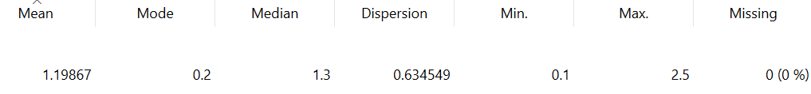

---
jupytext:
  formats: md:myst
  text_representation:
    extension: .md
    format_name: myst
    format_version: 0.13
    jupytext_version: 1.11.5
kernelspec:
  display_name: Python 3
  language: python
  name: python3
---

# Describe Data

Describe Data adalah proses menjelaskan atau merangkum karakteristik suatu dataset menggunakan statistik deskriptif agar kita dapat memahami isi data secara umum. Tahap ini biasanya dilakukan setelah proses pengumpulan data (collecting data) dan termasuk dalam tahap awal eksplorasi data (Exploratory Data Analysis/EDA). Dengan melakukan describe data, kita dapat mengetahui gambaran umum dataset seperti jumlah data, tipe atribut, nilai minimum dan maksimum, rata-rata, serta distribusi data.

```{note}
Describe data membantu analis untuk memahami struktur dataset sebelum masuk ke tahap analisis yang lebih kompleks seperti pemodelan atau prediksi.
```

## Tujuan Describe Data

Describe Data bertujuan untuk:

- Memahami gambaran umum dataset
- Menemukan data yang tidak normal atau tidak wajar
- Menjadi dasar sebelum membuat model
- Membantu pengambilan keputusan awal

```{note}
Dengan melakukan deskripsi data, kita dapat mengidentifikasi potensi masalah seperti data yang tidak seimbang, nilai ekstrem (outlier), atau kesalahan pencatatan data.
```

## Studi Kasus

Pada studi kasus ini digunakan Iris Flower Dataset yang sebelumnya telah dikumpulkan. Dataset tersebut memiliki 5 atribut dengan kategori sebagai berikut:

- sepal_length (numerik)
- sepal_width (numerik)
- petal_length (numerik)
- petal_width (numerik)
- species (kategorikal)

Setelah data diambil dari Iris Flower Dataset, kami melakukan visualisasi untuk salah satu fitur yaitu petal_width menggunakan software Orange Data Mining. Dari visualisasi distribusi yang ditampilkan, terlihat bahwa nilai petal_width memiliki persebaran yang cukup bervariasi, dengan beberapa kelompok nilai yang dominan. Hal ini menunjukkan adanya perbedaan ukuran lebar mahkota bunga pada masing-masing spesies.




Data dan fitur yang sama juga diimplementasikan menggunakan Python untuk memperoleh statistik deskriptif sebagai berikut:

```{code-cell}
import pandas as pd
from scipy import stats

df = pd.read_csv("../IRIS.csv")
kolom = df['petal_width']

print("Jumlah data        :", kolom.count())
print("Rata-rata          :", round(kolom.mean(), 2))
print("Nilai minimal      :", kolom.min())
print("Q1                 :", kolom.quantile(0.25))
print("Q2 (Median)        :", kolom.quantile(0.5))
print("Q3                 :", kolom.quantile(0.75))
print("Nilai maksimal     :", kolom.max())
print("Kemencengan (skew) :", round(kolom.skew(), 2))
mode = stats.mode(kolom, keepdims=True)
print("Nilai modus        :", mode.mode[0])
print("Jumlah modus       :", mode.count[0])

print("Standar deviasi    :", round(kolom.std(), 2))
print("Variansi           :", round(kolom.var(), 2))
```

Dari visualisasi yang ditampilkan, maka didapatkan data sebagai berikut
| Statis | Nilai |
|-------------------|------------------------|
| Mean | 1.20 |
| Modus | 0.2 |
| Median | 1.3 |
| Min | 0.1 |
| Max | 2.5 |
| Missing Values | 0 (0%) |

## Analisis Singkat

Berdasarkan hasil statistik deskriptif, atribut petal_width memiliki rata-rata sebesar 1.20 dengan nilai minimum 0.1 dan maksimum 2.5. Nilai median (1.3) sedikit lebih besar dari rata-rata, menunjukkan distribusi data relatif seimbang. Nilai skewness yang mendekati nol (-0.10) mengindikasikan bahwa distribusi data hampir simetris.

Standar deviasi sebesar 0.76 menunjukkan variasi data yang cukup jelas antar spesies bunga. Tidak ditemukan missing value (0%), sehingga data siap digunakan untuk tahap analisis atau pemodelan selanjutnya.

```{note}
Pada tahap ini, hanya diambil 1 (satu) atribut sebagai sampel yaitu atribut petal_width untuk melihat gambaran statistik deskriptifnya sebelum melanjutkan ke tahap analisis lebih lanjut.
```
