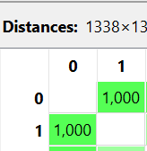

---
jupytext:
  formats: md:myst
  text_representation:
    extension: .md
    format_name: myst
    format_version: 0.13
    jupytext_version: 1.11.5
kernelspec:
  display_name: Python 3
  language: python
  name: python3
---

## Binary

Menghitung jarak data biner dari beberapa sampel data Insurance.

Misalnya dua sampel pertama:

```{code-cell}
import pandas as pd
import numpy as np
df = pd.read_csv("../../insurance.csv")
df.head(2)
```

Karena perhitungan jarak biner membutuhkan nilai 0 dan 1, maka dilakukan encoding:

- female = 0

- male = 1

- no = 0

- yes = 1

Sehingga menjadi:

| sex |	smoker |
|---------|-------|
| 0	| 1 |
| 1	| 0 |

### Menghitung Jarak Jaccard (Binary Distance)

Jarak biner yang umum digunakan adalah Jaccard Distance.

Rumus Jaccard Distance dalam bentuk LaTeX:

$$
d_{Jaccard}(x,y) =
\frac{b + c}{a + b + c}
$$

Keterangan:

- a = jumlah atribut bernilai 1 pada kedua data

- b = jumlah atribut bernilai 1 pada data pertama dan 0 pada data kedua

- c = jumlah atribut bernilai 0 pada data pertama dan 1 pada data kedua

#### Substitusi Manual

Data:

Data 1 → (0,1)
Data 2 → (1,0)

Maka:

- a = 0 (tidak ada yang sama-sama 1)

- b = 1

- c = 1

Sehingga:

$$
d =
\frac{1 + 1}{0 + 1 + 1}
=
\frac{2}{2}
=
1
$$

Jadi Jaccard Distance = 1, artinya kedua data sepenuhnya berbeda pada fitur biner.

## Implementasi Python

Berikut implementasi menggunakan Python seperti contoh sebelumnya:

```{code-cell}
import pandas as pd
from scipy.spatial.distance import jaccard

df = pd.read_csv("../../insurance.csv")

df['sex'] = df['sex'].map({'female':0, 'male':1})
df['smoker'] = df['smoker'].map({'no':0, 'yes':1})

binary_cols = ['sex', 'smoker']
df_binary = df[binary_cols]

p1 = df_binary.iloc[0]
p2 = df_binary.iloc[1]

jaccard_distance = jaccard(p1, p2)
print("Jaccard Distance:", jaccard_distance)
```



## Analisis

Nilai 1 menunjukkan bahwa kedua sampel berbeda sepenuhnya pada atribut biner.

Jika kedua sampel memiliki smoker yang sama dan sex yang sama, maka jaraknya bisa menjadi 0 (identik).