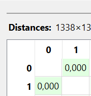

---
jupytext:
  formats: md:myst
  text_representation:
    extension: .md
    format_name: myst
    format_version: 0.13
    jupytext_version: 1.11.5
kernelspec:
  display_name: Python 3
  language: python
  name: python3
---

## Campuran (Mixed Data)

Menghitung jarak data campuran beberapa sampel dari dataset **Insurance**.

```{code-cell}
import pandas as pd
import numpy as np

df = pd.read_csv("../../insurance.csv")
df.head(5)
```

Dataset yang digunakan adalah **Medical Cost Personal Dataset** dari Kaggle. Dataset ini berisi informasi mengenai biaya asuransi kesehatan individu berdasarkan beberapa karakteristik seperti umur, jenis kelamin, indeks massa tubuh (BMI), jumlah anak, status perokok, wilayah tempat tinggal, serta total biaya asuransi yang dibayarkan.

Dataset ini memiliki **tipe data campuran**, yaitu kombinasi antara:

- Numerik  
- Kategorikal  
- Binary  

Data dengan tipe campuran sering ditemukan dalam analisis data dunia nyata sehingga metode perhitungan jarak harus mampu menangani berbagai tipe atribut dalam satu dataset.

### Struktur Dataset

| age | sex | bmi | children | smoker | region | charges |
|-----|-----|-----|-----|-----|-----|-----|
|19|female|27.9|0|yes|southwest|16884.924|
|18|male|33.77|1|no|southeast|1725.5523|

### Pemilihan Atribut

Untuk contoh perhitungan jarak data campuran digunakan atribut berikut:

**Numerik**
- age
- bmi
- children
- charges

**Kategorikal**
- sex
- region

**Binary**
- smoker

---

## Mengambil Dua Sampel Data

```{code-cell}
p1 = df.loc[0]
p2 = df.loc[1]

print("Data Pertama")
print(p1)

print("\nData Kedua")
print(p2)
```

---

## Menghitung Jarak Numerik (Manhattan)

Untuk atribut numerik digunakan **Manhattan Distance**.

Rumus Manhattan:

$$
d(x,y) = \sum_{i=1}^{n} |x_i - y_i|
$$

Implementasi Python:

```{code-cell}
num_cols = ["age","bmi","children","charges"]

num1 = df.loc[0, num_cols].values
num2 = df.loc[1, num_cols].values

manhattan = np.sum(np.abs(num1 - num2))

print("Manhattan Distance :", round(manhattan,4))
```

---

## Menghitung Jarak Kategorikal

Untuk atribut kategorikal digunakan perbandingan sederhana.

Jika nilai sama → 0  
Jika nilai berbeda → 1  

Rumus:

$$
d(x,y) = \frac{1}{n}\sum_{i=1}^{n}\delta(x_i \ne y_i)
$$

dengan:

$$
\delta(x_i \ne y_i)=
\begin{cases}
1 & jika\ berbeda \\
0 & jika\ sama
\end{cases}
$$

Implementasi Python:

```{code-cell}
cat_cols = ["sex","region"]

cat1 = df.loc[0, cat_cols].values
cat2 = df.loc[1, cat_cols].values

cat_distance = np.mean(cat1 != cat2)

print("Categorical Distance :", round(cat_distance,4))
```

---

## Menghitung Jarak Binary

Atribut binary pada dataset ini adalah **smoker**.

Jika nilai sama → 0  
Jika nilai berbeda → 1  

Implementasi Python:

```{code-cell}
bin_cols = ["smoker"]

bin1 = df.loc[0, bin_cols].values
bin2 = df.loc[1, bin_cols].values

bin_distance = np.mean(bin1 != bin2)

print("Binary Distance :", round(bin_distance,4))
```

---

## Menggabungkan Jarak Campuran

Total jarak campuran dihitung dengan mengambil rata-rata dari seluruh jarak atribut.

Rumus:

$$
D_{mixed} = \frac{d_{numerik} + d_{categorical} + d_{binary}}{3}
$$

Implementasi Python:

```{code-cell}
mixed_distance = np.mean([manhattan, cat_distance, bin_distance])

print("Mixed Distance :", round(mixed_distance,4))
```

---

## Kesimpulan

Dari hasil perhitungan di atas diperoleh nilai jarak antara dua data pertama pada dataset **Insurance**. Nilai jarak ini menunjukkan tingkat perbedaan karakteristik antara dua individu berdasarkan atribut numerik, kategorikal, dan binary.

Semakin kecil nilai jarak maka kedua data semakin mirip, sedangkan semakin besar nilai jarak menunjukkan perbedaan karakteristik yang semakin besar antara kedua data tersebut.

