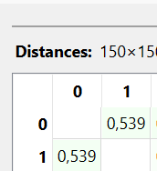
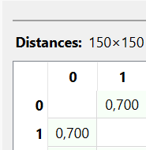

---
jupytext:
  formats: md:myst
  text_representation:
    extension: .md
    format_name: myst
    format_version: 0.13
    jupytext_version: 1.11.5
kernelspec:
  display_name: Python 3
  language: python
  name: python3
---

## IRIS

Menghitung Jarak Data Numerik (Iris Dataset)

```{code-cell}
import pandas as pd
import numpy as np
df = pd.read_csv("../../IRIS.csv")
df.head(5)
```

Pada bagian ini dilakukan perhitungan jarak data numerik menggunakan dataset Iris Flower Dataset yang diperoleh dari platform Kaggle. Dataset ini merupakan dataset klasik dalam machine learning yang sering digunakan untuk klasifikasi bunga iris berdasarkan ukuran kelopak dan mahkota bunga.

Dataset ini berisi beberapa atribut numerik yang menggambarkan karakteristik fisik bunga iris.

#### Struktur Dataset Iris

Beberapa atribut dalam dataset ini adalah:

- sepal_length (numerik)

- sepal_width (numerik)

- petal_length (numerik)

- petal_width (numerik)

- species (kategorikal)

Untuk perhitungan jarak numerik, hanya atribut bertipe numerik yang digunakan, yaitu:

- sepal_length

- sepal_width

- petal_length

- petal_width

#### Memilih Fitur Numerik

Menggunakan Python untuk memilih fitur numerik:

```{code-cell}
import pandas as pd
import numpy as np

df = pd.read_csv("../../IRIS.csv")

df_numeric = df.select_dtypes(include=[np.number])
print(df_numeric.dtypes)
```

#### Mengambil Sampel Data

Sebagai contoh, diambil dua baris pertama:

| index | sepal_length | sepal_width | petal_length | petal_width |
|-------|--------------|-------------|--------------|-------------|
| 0 | 5.1 | 3.5 | 1.4 | 0.2 |
| 1 | 4.9 | 3.0 | 1.4 | 0.2 |

### Euclidean Distance

Rumus Euclidean:

$$
d(x,y) = \sqrt{\sum_{i=1}^{n} (x_i - y_i)^2}
$$

Implementasi Python:

```{code-cell}
from scipy.spatial import distance

data1 = df_numeric.iloc[0]
data2 = df_numeric.iloc[1]

euclidean_distance = distance.euclidean(data1, data2)
print("Jarak Euclidean:", euclidean_distance)
```


Metode Euclidean menghitung jarak garis lurus antara dua titik dalam ruang multidimensi. Pada dataset Iris, setiap atribut numerik dianggap sebagai dimensi yang membentuk posisi suatu data dalam ruang tersebut.

### Manhattan Distance

Rumus Manhattan:

$$
d(x,y) = \sum_{i=1}^{n} |x_i - y_i|
$$

Perbedaan dengan Euclidean:

- Tidak dipangkatkan

- Tidak diakarkan

- Hanya menjumlahkan selisih absolut

Implementasi Python:

```{code-cell}
manhattan_distance = distance.cityblock(data1, data2)
print("Jarak Manhattan:", manhattan_distance)
```



Metode Manhattan menghitung jarak dengan menjumlahkan selisih absolut antar atribut.

### Perbandingan Euclidean dan Manhattan

| Metode | Hasil |
|-------|-------|
| Euclidean | 0.5385 |
| Manhattan | 0.7 |

Perbedaan nilai terjadi karena:

- Euclidean menghitung jarak garis lurus (straight-line distance).


- Manhattan menghitung jarak berdasarkan total pergerakan horizontal dan vertikal.

