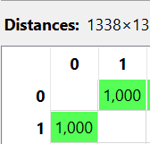

---
jupytext:
  formats: md:myst
  text_representation:
    extension: .md
    format_name: myst
    format_version: 0.13
    jupytext_version: 1.11.5
kernelspec:
  display_name: Python 3
  language: python
  name: python3
---

## Kategorikal

Menghitung jarak data kategorikal dari beberapa sampel data Insurance.

Dataset Insurance memiliki atribut:

```{code-cell}
import pandas as pd
import numpy as np
df = pd.read_csv("../../insurance.csv")
df.head(5)
```

Dari atribut tersebut, yang bertipe kategorikal adalah:

- sex

- smoker

- region

Sedangkan:

- age, bmi, children, charges → numerik (tidak dihitung pada bagian ini)

### Sampel Data

Misalnya digunakan dua data pertama:

```{code-cell}
import pandas as pd
import numpy as np
df = pd.read_csv("../../insurance.csv")
df.head(2)
```

Karena yang dihitung hanya kategorikal, maka yang diambil:

| sex    | smoker | region    |
| ------ | ------ | --------- |
| female | yes    | southwest |
| male   | no     | southeast |

### Metode Perhitungan

Untuk data kategorikal digunakan Simple Matching Distance, yaitu menghitung proporsi atribut yang berbeda.

Rumus dalam LaTeX:

$$
d(x,y) =
\frac{\text{jumlah atribut berbeda}}{\text{jumlah total atribut}}
$$

Atau bisa ditulis:

$$
d(x,y) =
\frac{\sum_{i=1}^{n} \delta(x_i \neq y_i)}{n}
$$

$$
\delta(x_i \neq y_i) =
\begin{cases}
1, & \text{jika } x_i \neq y_i \\
0, & \text{jika } x_i = y_i
\end{cases}
$$

### Perhitungan Manual

Bandingkan satu per satu:

| Atribut | Data 1    | Data 2    | Sama/Beda |
| ------- | --------- | --------- | --------- |
| sex     | female    | male      | beda (1)  |
| smoker  | yes       | no        | beda (1)  |
| region  | southwest | southeast | beda (1)  |

Jumlah berbeda = 3
Total atribut = 3

$$
d =
\frac{3}{3}
=
1
$$

Jadi jarak kategorikal = 1

Artinya kedua data sepenuhnya berbeda pada atribut kategorikal.

### Implementasi Python

Berikut implementasi seperti contoh sebelumnya:

```{code-cell}
import pandas as pd
import numpy as np

df = pd.read_csv("../../insurance.csv")

cols = ["sex","smoker","region"]

p1 = df.loc[0, cols].values
p2 = df.loc[1, cols].values

distance = np.mean(p1 != p2)

print("Categorical Distance:", distance)
```



### Analisis

Nilai 1 menunjukkan seluruh atribut kategorikal berbeda.

Jika misalnya region sama tetapi sex dan smoker berbeda, maka:

- berbeda = 2

- total = 3

Maka:

$$
d = \frac{2}{3} = 0.67
$$