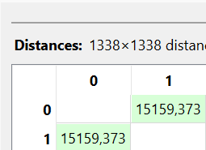
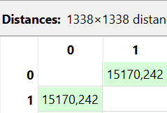

---
jupytext:
  formats: md:myst
  text_representation:
    extension: .md
    format_name: myst
    format_version: 0.13
    jupytext_version: 1.11.5
kernelspec:
  display_name: Python 3
  language: python
  name: python3
---

## Numerik

Menghitung Jarak Data Numerik (Insurance Dataset)

```{code-cell}
import pandas as pd
import numpy as np
df = pd.read_csv("../../insurance.csv")
df.head(5)
```

Pada bagian ini dilakukan perhitungan jarak data numerik menggunakan dataset Medical Cost Personal Datasets yang diperoleh dari platform Kaggle. Dataset ini berisi data biaya asuransi kesehatan individu dengan beberapa atribut numerik dan kategorikal.

#### Struktur Dataset Insurance

Beberapa atribut dalam dataset ini adalah:

- age (numerik)

- sex (kategorikal)

- bmi (numerik)

- children (numerik)

- smoker (kategorikal)

- region (kategorikal)

- charges (numerik)

Untuk perhitungan jarak numerik, hanya atribut bertipe numerik yang digunakan, yaitu:

- age

- bmi

- children

- charges

#### Memilih Fitur Numerik

Menggunakan Python untuk memilih fitur numerik:

```{code-cell}
import pandas as pd
import numpy as np

df = pd.read_csv("../../insurance.csv")

df_numeric = df.select_dtypes(include=[np.number])
print(df_numeric.dtypes)
```

#### Mengambil Sampel Data

Sebagai contoh, diambil dua baris pertama:

| index | age | bmi | children | charges |
|-------|-----|------|------|----|
| 0 | 19 | 27.9 | 0 | 16884924 |
| 1 | 18 | 33.77 | 1 | 17255523 |

### Euclidean Distance

Rumus Euclidean:

$$
d(x,y) = \sqrt{\sum_{i=1}^{n} (x_i - y_i)^2}
$$

Implementasi Python:

```{code-cell}
from scipy.spatial import distance

data1 = df_numeric.iloc[0]
data2 = df_numeric.iloc[1]

euclidean_distance = distance.euclidean(data1, data2)
print("Jarak Euclidean:", euclidean_distance)
```



Karena nilai charges memiliki rentang sangat besar dibanding fitur lain, maka nilai jarak Euclidean juga menjadi besar. Hal ini menunjukkan pentingnya normalisasi sebelum menghitung jarak pada dataset dengan skala berbeda.

### Manhattan Distance

Rumus Manhattan:

$$
d(x,y) = \sum_{i=1}^{n} |x_i - y_i|
$$

Perbedaan dengan Euclidean:

- Tidak dipangkatkan

- Tidak diakarkan

- Hanya menjumlahkan selisih absolut

Implementasi Python:

```{code-cell}
manhattan_distance = distance.cityblock(data1, data2)
print("Jarak Manhattan:", manhattan_distance)
```




### Perbandingan Euclidean dan Manhattan

| Metode |	Hasil |
|---------|-------|
| Euclidean	| 15159.47 |
| Manhattan	| 15175.54 |

Perbedaan nilai terjadi karena:

- Euclidean menghitung jarak garis lurus (straight-line distance).


- Manhattan menghitung jarak berdasarkan total pergerakan horizontal dan vertikal.


