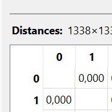

---
jupytext:
  formats: md:myst
  text_representation:
    extension: .md
    format_name: myst
    format_version: 0.13
    jupytext_version: 1.11.5
kernelspec:
  display_name: Python 3
  language: python
  name: python3
---

## Ordinal

Mengukur Jarak untuk Atribut Ordinal

Dataset Insurance awalnya memiliki:

- Numerik → age, bmi, children, charges

- Kategorikal → sex, smoker, region

Namun tidak ada atribut ordinal secara langsung.

### Mengubah BMI menjadi kategori tingkat risiko

Misalnya kita kategorikan BMI menjadi:

| Rentang BMI | Kategori    | Ranking |
| ----------- | ----------- | ------- |
| < 18.5      | Underweight | 1       |
| 18.5 – 24.9 | Normal      | 2       |
| 25 – 29.9   | Overweight  | 3       |
| ≥ 30        | Obese       | 4       |


Sekarang atribut bmi berubah dari numerik → ordinal.

#### Rumus Transformasi Ordinal

Untuk atribut ordinal, kita ubah ranking menjadi nilai dalam rentang [0,1].

Jika:

- $r_{if}$ = ranking objek ke-$i$  
- $M_f$ = jumlah level ordinal

Maka normalisasi dilakukan dengan:

$$
z_{if} = \frac{r_{if} - 1}{M_f - 1}
$$

#### Menghitung Jarak Ordinal

Setelah dinormalisasi, jarak dihitung seperti numerik:

$$
d_{ij}^{(f)} = \left| z_{if} - z_{jf} \right|
$$

Contoh Perhitungan Dua Data

Misalkan:

Data 1 → BMI = 27.9 → Overweight → ranking = 3
Data 2 → BMI = 33.77 → Obese → ranking = 4

Jumlah level 

$M_f = 4$

- Normalisasi

Data 1:
$$
z_1 = \frac{3 - 1}{4 - 1} = \frac{2}{3} = 0.667
$$

Data 2

$$
z_2 = \frac{4 - 1}{4 - 1} = \frac{3}{3} = 1
$$


- Hitung Jarak

$$
d_{bmi} = \left| 0.667 - 1 \right| = 0.333
$$

#### Rumus Jarak Campuran (Dengan Ordinal)

Jika kita gabungkan numerik, kategorikal, dan ordinal:

$$
d(i,j) =
\frac{
\sum d_{\text{numerik}} +
\sum d_{\text{ordinal}} +
\sum d_{\text{kategori}}
}{p}
$$

Dengan:

$$
0 \le d(i,j) \le 1
$$

## Implementasi Python (Ordinal)

```{code-cell}
import pandas as pd
import numpy as np

df = pd.read_csv("../../insurance.csv")

def bmi_category(bmi):
    if bmi < 18.5:
        return 1
    elif bmi < 25:
        return 2
    elif bmi < 30:
        return 3
    else:
        return 4

df['bmi_ordinal'] = df['bmi'].apply(bmi_category)

M = 4
df['bmi_norm'] = (df['bmi_ordinal'] - 1) / (M - 1)

z1 = df['bmi_norm'].iloc[0]
z2 = df['bmi_norm'].iloc[1]

distance_ordinal = abs(z1 - z2)

print("Jarak Ordinal BMI:", distance_ordinal)
```
