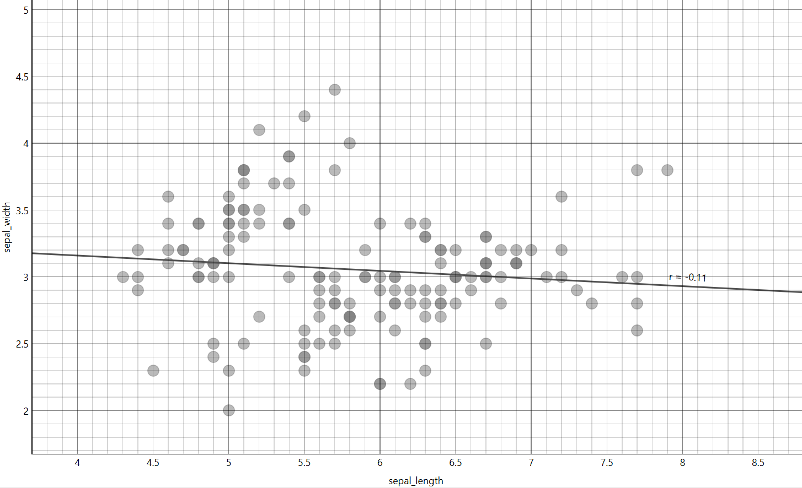
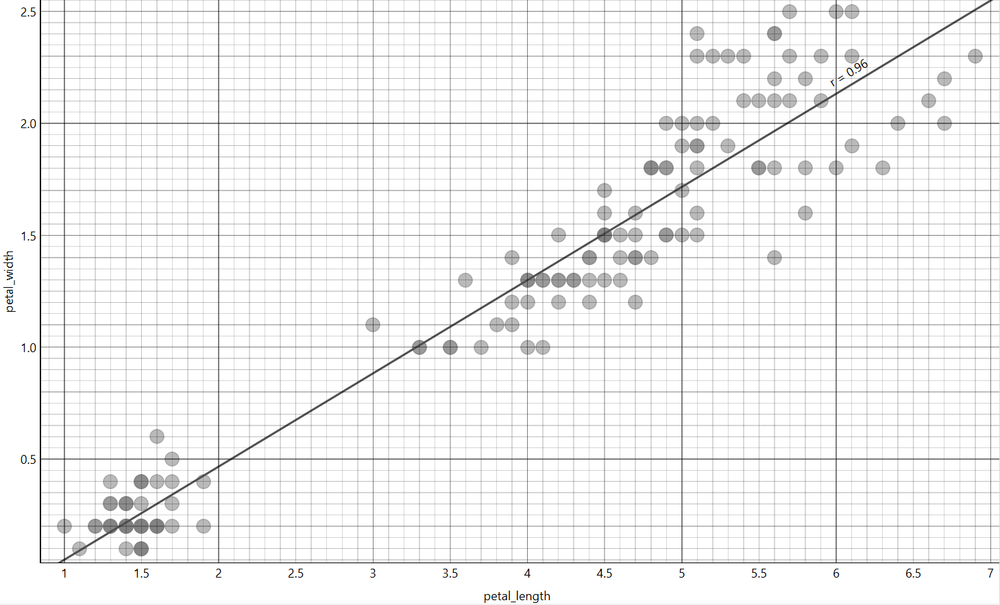
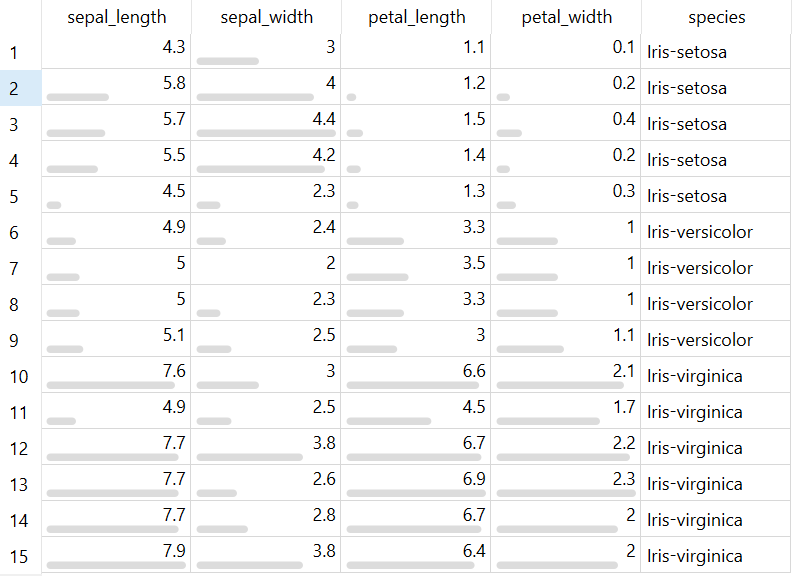

---
jupytext:
  formats: md:myst
  text_representation:
    extension: .md
    format_name: myst
    format_version: 0.13
    jupytext_version: 1.11.5
kernelspec:
  display_name: Python 3
  language: python
  name: python3
---

# Exsplorasi Data

Data Exploration (Eksplorasi Data) adalah tahap analisis awal yang dilakukan untuk memahami lebih dalam isi dataset melalui statistik deskriptif dan visualisasi. Pada tahap ini, data tidak hanya diringkas, tetapi juga dianalisis untuk melihat pola, distribusi, kecenderungan nilai, serta hubungan antarvariabel. Eksplorasi data membantu menemukan informasi tersembunyi yang tidak terlihat hanya dari tabel angka.

Tahap ini sangat penting karena hasil eksplorasi akan menjadi dasar dalam menentukan metode analisis atau model machine learning yang akan digunakan. Dengan memahami karakteristik data terlebih dahulu, kita dapat menghindari kesalahan dalam pemilihan algoritma dan meningkatkan akurasi hasil pemodelan.

## Tujuan Data Exploration

Berikut adalah beberapa tujuan utama dari Data Exploration:

1. Mengetahui distribusi data
Untuk melihat pola penyebaran nilai, apakah berdistribusi normal, miring (skewed), atau memiliki pola tertentu.
2. Mengidentifikasi pola atau tren tertentu
Untuk menemukan kecenderungan nilai dalam dataset, misalnya peningkatan, penurunan, atau pengelompokan tertentu.
3. Menganalisis hubungan antarvariabel
Untuk mengetahui apakah terdapat korelasi atau keterkaitan antar fitur yang dapat memengaruhi hasil analisis.
4. endeteksi ketidakseimbangan data (imbalanced data)
Terutama pada kasus klasifikasi, untuk melihat apakah jumlah data pada setiap kelas seimbang atau tidak.
5. Menemukan outlier atau anomali
Untuk mengidentifikasi nilai ekstrem yang dapat memengaruhi hasil analisis atau model.
6. Mengidentifikasi variabel yang berpengaruh signifikan terhadap target
Untuk menentukan fitur mana yang paling relevan dalam proses pemodelan.
7. Menjadi dasar dalam menentukan metode analisis atau pemodelan
Hasil eksplorasi membantu dalam memilih algoritma yang paling sesuai dengan karakteristik data.

## Visualisasi Data

Visualisasi data merupakan proses menyajikan data dalam bentuk grafik atau diagram agar lebih mudah dipahami. Dengan visualisasi, kita dapat melihat pola, distribusi, perbandingan, serta anomali dalam data secara lebih jelas dibandingkan hanya melihat tabel angka. Visualisasi juga membantu dalam proses eksplorasi data sebelum masuk ke tahap pemodelan.

### Histogram

Salah satu cara untuk mengetahui distribusi data adalah menggunakan Histogram. Histogram adalah grafik yang digunakan untuk menampilkan distribusi frekuensi data numerik dalam bentuk batang (bar) yang saling berdempetan. Grafik ini menunjukkan bagaimana data tersebar ke dalam beberapa interval nilai yang disebut bin atau kelas.

Pada histogram:

- Sumbu horizontal (X) menunjukkan rentang nilai atau interval data.

- Sumbu vertikal (Y) menunjukkan jumlah frekuensi atau banyaknya data dalam setiap interval.

Berbeda dengan diagram batang biasa, pada histogram tidak terdapat jarak antar batang karena data yang ditampilkan bersifat kontinu (berkelanjutan).

Histogram sangat berguna untuk:

- Melihat apakah data berdistribusi normal atau tidak

- Mengetahui apakah data condong ke kiri (negative skew) atau ke kanan (positive skew)

- Mengidentifikasi adanya outlier

- Melihat kepadatan data pada rentang nilai tertentu

```{figure} ../gambar/H_SL.png
---
width: 60%
align: center
---
Histogram Distribusi Frekuensi Fitur sepal_length
```

```{figure} ../gambar/H_SW.png
---
width: 60%
align: center
---
Histogram Distribusi Frekuensi Fitur sepal_width
```

```{figure} ../gambar/H_PL.png
---
width: 60%
align: center
---
Histogram Distribusi Frekuensi Fitur petal_length
```

```{figure} ../gambar/H_PW.png
---
width: 60%
align: center
---
Histogram Distribusi Frekuensi Fitur petal_width
```

```{figure} ../gambar/H_S.png
---
width: 60%
align: center
---
Histogram Distribusi Frekuensi Fitur species
```
### Scatter Plot

Selain histogram, visualisasi lain yang sering digunakan dalam eksplorasi data adalah Scatter Plot. Scatter plot adalah grafik yang digunakan untuk menampilkan hubungan antara dua variabel numerik dalam bentuk titik-titik pada bidang koordinat. Grafik ini sangat efektif untuk melihat pola hubungan, tren, maupun korelasi antarvariabel.

Pada scatter plot:

- Sumbu X mewakili variabel pertama.

- Sumbu Y mewakili variabel kedua.

- Setiap titik merepresentasikan satu pasangan data (x, y).

```{note}
Tujuan utama scatter plot adalah untuk melihat apakah terdapat hubungan (korelasi) antara dua variabel, serta mengetahui arah dan kekuatan hubungan tersebut.
```

#### Fungsi Scatter Plot

Scatter plot memiliki beberapa fungsi penting, antara lain:

- Mengetahui hubungan antarvariabel (positif, negatif, atau tidak ada hubungan).

- Melihat pola atau tren data, apakah linear atau non-linear.

- Mendeteksi outlier (data yang menyimpang dari pola umum).

- Membantu dalam analisis regresi atau korelasi.

#### Studi Kasus – Iris Dataset

Pada studi kasus menggunakan Iris Flower Dataset, dilakukan analisis hubungan antar beberapa atribut numerik.

##### Scatter Plot sepal_length dan sepal_width



Berdasarkan scatter plot antara sepal_length dan sepal_width, diperoleh nilai korelasi sebesar r = -0,11. Nilai ini menunjukkan hubungan negatif yang sangat lemah. Artinya, peningkatan nilai sepal_length tidak memiliki hubungan linear yang signifikan terhadap perubahan sepal_width. Titik-titik pada grafik cenderung tersebar tanpa pola linear yang jelas.

##### Scatter Plot petal_length dan petal_width



Berdasarkan scatter plot antara petal_length dan petal_width, terlihat adanya korelasi positif yang sangat kuat. Hal ini menunjukkan bahwa semakin besar nilai petal_length, maka petal_width juga cenderung meningkat secara linear.

```{note}
Jika korelasi dinyatakan sangat kuat dan positif, maka nilai r seharusnya mendekati +1, bukan -0,11. Nilai r = -0,11 menunjukkan korelasi negatif yang sangat lemah.
```

Dalam dataset Iris, pasangan petal_length dan petal_width memang dikenal memiliki korelasi positif yang tinggi, sehingga sangat membantu dalam proses klasifikasi spesies bunga.

### Outlier

Outlier adalah nilai data yang menyimpang jauh dari sebagian besar data lainnya dalam suatu dataset. Outlier sering disebut sebagai data pencilan karena posisinya berada di luar pola umum distribusi data. Secara sederhana, outlier adalah data yang nilainya terlalu tinggi atau terlalu rendah dibandingkan data lain yang sejenis.

Keberadaan outlier dapat memengaruhi hasil analisis, terutama pada perhitungan statistik seperti mean, standar deviasi, maupun dalam proses pemodelan machine learning. Oleh karena itu, penting untuk mendeteksi dan menganalisis outlier sebelum melanjutkan ke tahap modeling.

#### Metode Deteksi Outlier

Terdapat beberapa metode yang dapat digunakan untuk mendeteksi outlier, antara lain:

- Metode Statistik (Z-Score, IQR)

- Boxplot

- Isolation Forest

- Local Outlier Factor (LOF)

```{note}
Pada studi kasus ini, digunakan metode Local Outlier Factor (LOF) untuk mendeteksi outlier pada Iris Flower Dataset.
```

#### Local Outlier Factor (LOF)

Local Outlier Factor (LOF) adalah metode berbasis kepadatan (density-based) yang digunakan untuk mengidentifikasi data pencilan dengan membandingkan kepadatan suatu titik terhadap kepadatan titik-titik di sekitarnya.

Konsep dasarnya adalah:

- Jika suatu data memiliki kepadatan yang jauh lebih rendah dibandingkan tetangganya, maka data tersebut kemungkinan besar merupakan outlier.

- LOF tidak hanya melihat jarak global, tetapi mempertimbangkan kepadatan lokal di sekitar titik data.

```{note}
Metode ini cocok digunakan pada dataset multidimensi seperti Iris karena dapat mempertimbangkan hubungan antar beberapa fitur sekaligus.
```

#### Hasil Studi Kasus



Berdasarkan perhitungan menggunakan metode Local Outlier Factor, diperoleh sebanyak 15 data yang teridentifikasi sebagai outlier dari total 150 data.

Artinya, sekitar 10% data dianggap memiliki kepadatan yang berbeda secara signifikan dibandingkan data lainnya. Data-data ini perlu dianalisis lebih lanjut untuk menentukan apakah:

- Merupakan kesalahan pencatatan (error data), atau

- Merupakan variasi alami yang memang valid

```{note}
Keputusan untuk menghapus atau mempertahankan outlier harus disesuaikan dengan tujuan analisis dan konteks permasalahan bisnis.
```