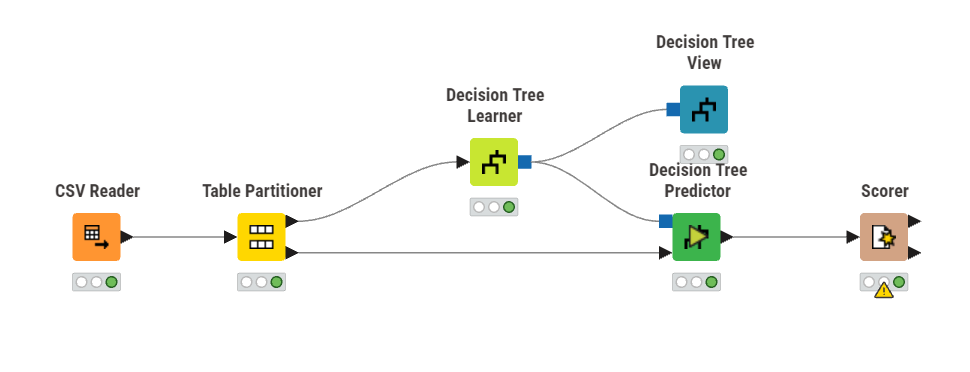
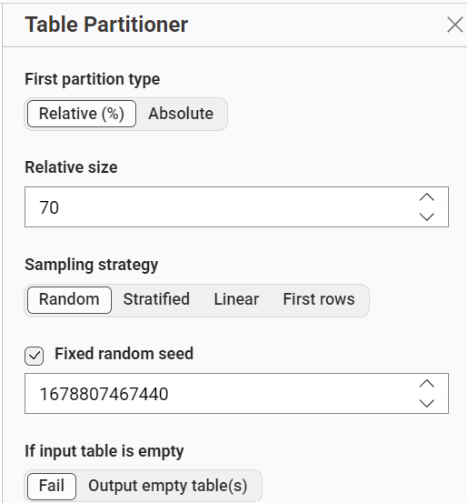
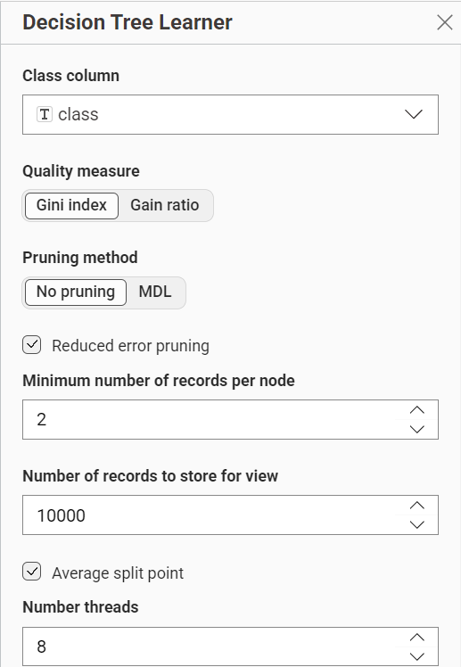
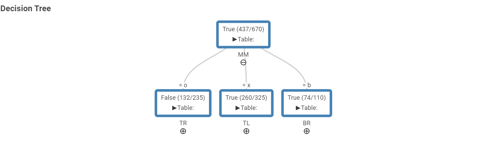
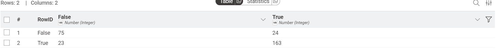
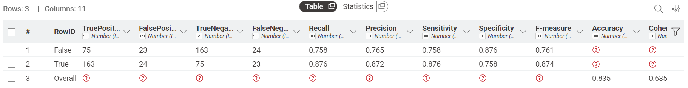

---
jupytext:
  formats: md:myst
  text_representation:
    extension: .md
    format_name: myst
    format_version: 0.13
    jupytext_version: 1.11.5
kernelspec:
  display_name: Python 3
  language: python~
  name: python3
---

# Decision Tree
## Dataset
Dataset yang digunakan untuk klasifikasi ini adalah `Tic-Tac-Toe Endgame Dataset`. Dataset ini merepresentasikan kumpulan seluruh kemungkinan susunan akhir (*endgame*) pada papan permainan Tic-Tac-Toe. Tujuannya adalah untuk mengklasifikasikan apakah pemain 'x' (yang diasumsikan bermain lebih dulu) berhasil memenangkan permainan atau tidak berdasarkan konfigurasi akhir di atas papan.

Link : [Tic-Tac-Toe Endgame Dataset](https://www.kaggle.com/datasets/somesh24/tictactoe)

Dataset ini memiliki 958 baris data, 9 fitur yang bertipe kategorikal, dan 1 label yang bernama `class` yang memiliki 2 nilai Boolean, yaitu `True` yang berarti pemain 'x' berhasil menang, dan `False` yang berarti pemain 'x' kalah atau permainan berakhir seri.

Berikut seluruh fitur beserta nilai kategorinya:

| No | Nama Fitur | Deskripsi | Nilai Kategori |
|----|------------|-----------|----------------|
| 1  | TL | Posisi kotak di Kiri Atas (*Top-Left*) | x, o, b |
| 2  | TM | Posisi kotak di Tengah Atas (*Top-Middle*) | x, o, b |
| 3  | TR | Posisi kotak di Kanan Atas (*Top-Right*) | x, o, b |
| 4  | ML | Posisi kotak di Kiri Tengah (*Middle-Left*) | x, o, b |
| 5  | MM | Posisi kotak tepat di Tengah Pusat (*Middle-Middle*) | x, o, b |
| 6  | MR | Posisi kotak di Kanan Tengah (*Middle-Right*) | x, o, b |
| 7  | BL | Posisi kotak di Kiri Bawah (*Bottom-Left*) | x, o, b |
| 8  | BM | Posisi kotak di Tengah Bawah (*Bottom-Middle*) | x, o, b |
| 9  | BR | Posisi kotak di Kanan Bawah (*Bottom-Right*) | x, o, b |

*(Keterangan: `x` = diisi pemain X, `o` = diisi pemain O, `b` = blank / kosong)*

## Implementasi Pada KNime
Workflow ini dirancang menggunakan tools KNIME untuk membangun model klasifikasi Decision Tree. Bertujuan untuk menentukan apakah pemain 'x' diprediksi menang atau tidak.

### Partisi
Langkah awal setelah membaca dataset adalah melakukan partisi, yaitu untuk membagi data training dan data testing. Dalam kasus ini, saya menggunakan data sebanyak 70% sebagai data training dan 30% sebagai data testing.

### Decision Tree Learner

Dikarenakan saya menggunakan `Gain Ratio` pada _Quality Measure_, maka perlu menghitung `Gain Ratio` tertinggi untuk menentukan _Root_ atau akar dari `Decision Tree` dengan rumus sebagai berikut.

$$
\begin{aligned}
\\[10pt]
GainRATIO_{split} &= \frac{Gain_{split}}{SplitINFO} \\[10pt]
Gain_{split} &= Entropy(p) - (\sum_{i=1}^{k} {\frac{n_{i}}{n}Entropy(i)})  \\[10pt]
Entropy(t) &= - \sum{p(j|t) \log_{2}(p(j|t))}  \\[10pt]
SplitINFO &= - \sum_{i=1}^k{\frac{n_{i}}{n}\log_{2}\frac{n_{i}}{n}}
\end{aligned}
$$

Dimana :
1.  $GainRATIO_{split}$ merupakan nilai rasio gain untuk suatu atribut pemisah (split). Semakin tinggi nilainya, semakin baik atribut tersebut dipilih sebagai node pemisah.
2.  $Gain_{split}$ merupakan selisih entropy sebelum dan sesudah pemisahan data berdasarkan atribut tertentu. Mengukur seberapa besar pengurangan ketidakpastian setelah data dipecah.
    * $Entropy(p)$ merupakan Entropy dari dataset induk (parent) sebelum split
    * $k$ merupakan Jumlah cabang/subset hasil pemisahan 
    * $i$ merupakan Indeks cabang ke-i (dari 1 sampai k)
    * $n$ merupakan Jumlah total data di node induk
    * $n_{i}$ merupakan Jumlah data pada cabang/subset ke-i
    * $Entropy(i)$ merupakan Entropy dari subset ke-i setelah split
3.  $Entropy(t)$ Mengukur tingkat ketidakmurnian (impurity) atau ketidakpastian pada node $t$
    * $t$ Node yang sedang dihitung
    * $j$ Label kelas ke-j
    * $p(j|t)$ Probabilitas kelas j pada node t
    * $log_{2}$ Logaritma basis 2
> **Note:**
> Entropy = 0 berarti data murni (satu kelas)
> Entropy = 1 berarti data paling tidak pasti (seimbang antar kelas)

4.  $SplitINFO$ Mengukur seberapa luas dan merata suatu atribut membagi data. Digunakan sebagai pembagi (denominator) agar atribut dengan banyak cabang tidak selalu dipilih.

#### Hitung Entropy Root
* Jumlah kelas `True` = 626
* Jumlah kelas `False` = 332
* Jumlah Data = 958

$$
\begin{aligned}
Entropy(s) &= -\frac{626}{958} \log_2 \left(\frac{626}{958}\right) - \frac{332}{958} \log_2 \left(\frac{332}{958}\right) \\[1em]
Entropy(s) &= -0.6534 \times (-0.6138) - 0.3466 \times (-1.5289) \\[1em]
Entropy(s) &= 0.4011 + 0.5298 = 0.9309
\end{aligned}
$$

#### Hitung Gain, Split Info, dan Gain Ratio tiap Atribut

Berdasarkan perhitungan algoritma, letak papan tengah atau `MM` (Middle-Middle) adalah atribut yang paling krusial karena menghasilkan nilai *Gain Ratio* tertinggi di antara semua atribut lainnya. Berikut adalah rincian perhitungannya:

###### Atribut `MM` (Middle-Middle)
1. **Hitung entropy pada tiap nilai**

    Dikarenakan atribut `MM` memiliki 3 nilai unik (kategorikal: `b`, `o`, `x`), maka perlu menghitung masing-masing entropy pada nilai tersebut dengan rumus:

    $Entropy(v) = - \frac{True_{v}}{n_{v}} \log_2 \left(\frac{True_{v}}{n_{v}}\right) -  \frac{False_{v}}{n_{v}} \log_2 \left(\frac{False_{v}}{n_{v}}\right)$

    * **MM `b` (blank / kosong)**
        * $n = 160$
        * $True = 112$
        * $False = 48$

        $$
            \begin{aligned}
            Entropy(b) &= - \frac{112}{160} \log_2 \left(\frac{112}{160}\right) -  \frac{48}{160} \log_2 \left(\frac{48}{160}\right) \\[10pt]
            Entropy(b) &= - 0.7000 \times (-0.5146) - 0.3000 \times (-1.7370) \\[10pt]
            Entropy(b) &= 0.3602 + 0.5211 = 0.8813
            \end{aligned}
        $$
    
    * **MM `o` (diisi O)**
        * $n = 340$
        * $True = 148$
        * $False = 192$

        $$
            \begin{aligned}
            Entropy(o) &= - \frac{148}{340} \log_2 \left(\frac{148}{340}\right) -  \frac{192}{340} \log_2 \left(\frac{192}{340}\right) \\[10pt]
            Entropy(o) &= - 0.4353 \times (-1.1999) - 0.5647 \times (-0.8244) \\[10pt]
            Entropy(o) &= 0.5223 + 0.4655 = 0.9878
            \end{aligned}
        $$

    * **MM `x` (diisi X)**
        * $n = 458$
        * $True = 366$
        * $False = 92$

        $$
            \begin{aligned}
            Entropy(x) &= - \frac{366}{458} \log_2 \left(\frac{366}{458}\right) -  \frac{92}{458} \log_2 \left(\frac{92}{458}\right) \\[10pt]
            Entropy(x) &= - 0.7991 \times (-0.3235) - 0.2009 \times (-2.3154) \\[10pt]
            Entropy(x) &= 0.2585 + 0.4652 = 0.7237
            \end{aligned}
        $$

2. **Hitung Gain Split**

    Untuk menghitung Gain Split, digunakan rumus sebagai berikut:

    $Gain_{split} = Entropy(p) - (\sum_{i=1}^{k} {\frac{n_{i}}{n}Entropy(i)})$

    Hitung Weighted Entropy:
    
    $$
    \begin{aligned}
     &= \frac{160}{958}(0.8813) + \frac{340}{958}(0.9878) + \frac{458}{958}(0.7237) \\[10pt]
     &= 0.1670 \times 0.8813 + 0.3549 \times 0.9878 + 0.4781 \times 0.7237 \\[10pt]
     &= 0.1472 + 0.3506 + 0.3460 \\[10pt]
     &= 0.8438
     \end{aligned}
    $$

    Maka:
    $Gain_{split} = 0.9309 - 0.8438 = 0.0871$

3. **Hitung Split Info**

    Untuk menghitung Split Info, digunakan rumus sebagai berikut:
    
    $SplitINFO = - \sum_{i=1}^k{\frac{n_{i}}{n}\log_{2}\left(\frac{n_{i}}{n}\right)}$

    Maka:

    $$
    \begin{aligned}
        SplitINFO(MM) &= - \frac{160}{958} \log_2 \left(\frac{160}{958}\right) - \frac{340}{958} \log_2 \left(\frac{340}{958}\right) -\frac{458}{958} \log_2 \left(\frac{458}{958}\right) \\[10pt]
        SplitINFO(MM) &= - 0.1670 \times (-2.5820) - 0.3549 \times (-1.4945) - 0.4781 \times (-1.0646) \\[10pt] 
        SplitINFO(MM) &= 0.4312 + 0.5304 + 0.5090 \\[10pt] 
                      &= 1.4706
    \end{aligned}
    $$

4. **Hitung Gain Ratio**

    Untuk menghitung Gain Ratio, digunakan rumus sebagai berikut:

    $GainRATIO_{split} = \frac{Gain_{split}}{SplitINFO}$

    Maka:

    $GainRATIO_{MM} = \frac{0.0871}{1.4706} = 0.0592$

> **Note:**
> Hal yang sama dilakukan untuk semua sisa atribut mulai dari entropy pada tiap nilai, Gain Split, Split Info dan Gain Ratio.

Setelah `Gain Ratio` dari semua atribut dihitung, atribut `MM` memiliki Gain Ratio tertinggi (**0.0592**) sehingga dipilih secara resmi sebagai `Root Node`. 
Setelah root ditemukan, proses yang sama persis diulang secara rekursif pada setiap cabang yang belum `pure`, menggunakan subset data dan atribut yang tersisa, sampai semua cabang menjadi Leaf Node.

> **Note:**
> Pure artinya semua data dalam satu node hanya terdiri dari satu kelas saja atau tidak ada campuran (entropy = 0).

#### Tree
Setelah semua node `pure`, berarti pohon sudah selesai dibangun. Implementasi pada KNime menggunakan node `Decision Tree View` menghasilkan Tree sebagai berikut:

### Decision Tree Predictor
Node ini digunakan untuk menguji kemampuan model tersebut. Node ini akan menerapkan aturan logika yang telah dipelajari ke dalam data testing untuk memprediksi apakah status akhirnya adalah `True` (x menang) atau `False`.

#### Confusion Matrix

#### Akurasi
