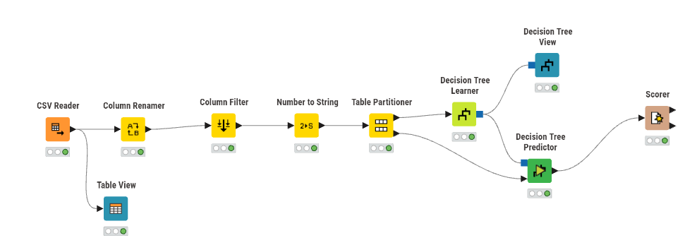
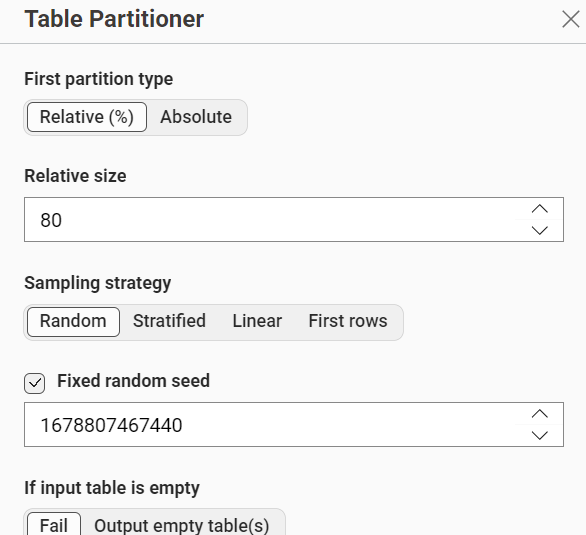
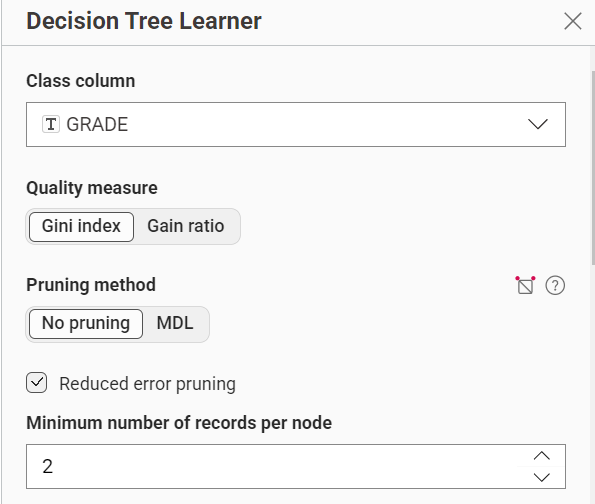
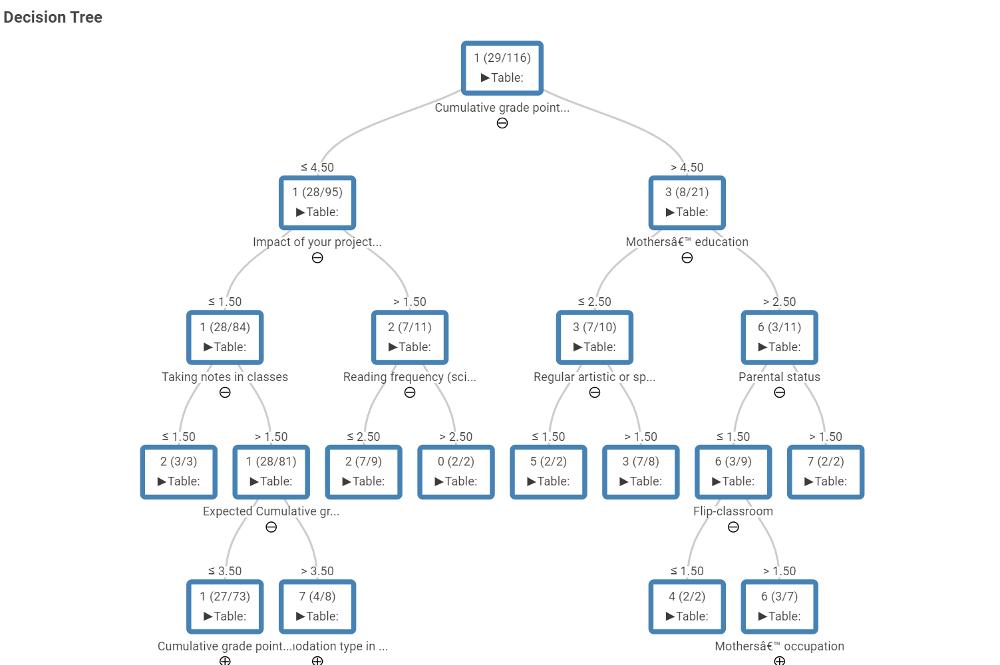
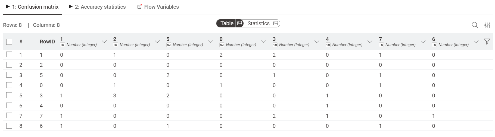
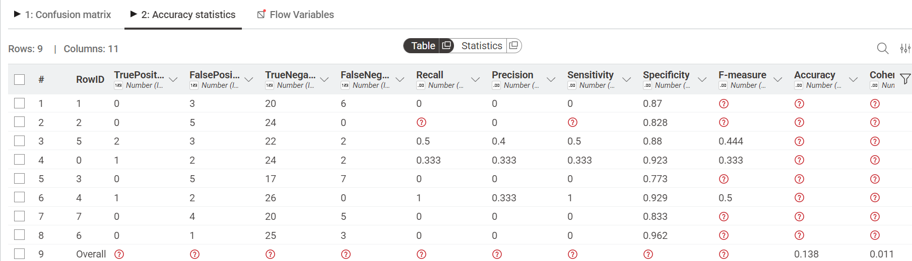

---
jupytext:
  formats: md:myst
  text_representation:
    extension: .md
    format_name: myst
    format_version: 0.13
    jupytext_version: 1.11.5
kernelspec:
  display_name: Python 3
  language: python~
  name: python3
---

# Decision Tree UAS

## Dataset

Dataset yang digunakan untuk klasifikasi ini adalah **Higher Education Students Performance Evaluation Dataset**, yang dikumpulkan dari mahasiswa Faculty of Engineering dan Faculty of Educational Sciences pada tahun 2019. Tujuannya adalah untuk memprediksi nilai akhir (*end-of-term grade*) mahasiswa berdasarkan jawaban kuesioner tentang data pribadi, keluarga, dan kebiasaan belajar.

Link: [Higher Education Students Performance Evaluation — UCI ML Repository](https://archive.ics.uci.edu/dataset/856/higher+education+students+performance+evaluation)

Dataset ini memiliki **145 baris data**, **30 fitur kuesioner bertipe kategorikal (ordinal)** + 1 kolom `COURSE ID`, dan 1 label bernama `GRADE` yang memiliki **8 nilai kelas** (0 = Fail, 1 = DD, 2 = DC, 3 = CC, 4 = CB, 5 = BB, 6 = BA, 7 = AA).

Berikut fitur-fitur beserta nilai kategorinya (1–10 pertanyaan pribadi, 11–16 pertanyaan keluarga, 17–30 kebiasaan belajar):

| No | Nama Kolom Asli | Nama Setelah Rename | Deskripsi | Nilai Kategori |
| -- | ---------------- | -------------------- | --------- | --------------- |
| 1 | 1 | AGE | Usia mahasiswa | 1: 18–21, 2: 22–25, 3: >26 |
| 2 | 2 | SEX | Jenis kelamin | 1: perempuan, 2: laki-laki |
| 3 | 3 | HS_TYPE | Tipe SMA asal | 1: swasta, 2: negeri, 3: lainnya |
| 4 | 4 | SCHOLARSHIP | Jenis beasiswa | 1: tidak ada, 2: 25%, 3: 50%, 4: 75%, 5: penuh |
| 5 | 5 | ADD_WORK | Kerja sambilan | 1: ya, 2: tidak |
| 6 | 6 | ARTISTIC_SPORT | Aktivitas seni/olahraga rutin | 1: ya, 2: tidak |
| 7 | 7 | PARTNER | Punya pasangan | 1: ya, 2: tidak |
| 8 | 8 | SALARY | Total gaji (jika ada) | 1: 135–200, 2: 201–270, 3: 271–340, 4: 341–410, 5: >410 (USD) |
| 9 | 9 | TRANSPORT | Transportasi ke kampus | 1: bus, 2: mobil/taksi, 3: sepeda, 4: lainnya |
| 10 | 10 | ACCOMMODATION | Tempat tinggal | 1: sewa, 2: asrama, 3: dengan keluarga, 4: lainnya |
| 11 | 11 | MOTHER_EDU | Pendidikan ibu | 1: SD s/d 6: S3 |
| 12 | 12 | FATHER_EDU | Pendidikan ayah | 1: SD s/d 6: S3 |
| 13 | 13 | SIBLINGS | Jumlah saudara kandung | 1 s/d 5 (5 = ≥5) |
| 14 | 14 | PARENTAL_STATUS | Status orang tua | 1: menikah, 2: cerai, 3: meninggal (salah satu/keduanya) |
| 15 | 15 | MOTHER_JOB | Pekerjaan ibu | 1: pensiun, 2: IRT, 3: PNS, 4: swasta, 5: wirausaha, 6: lainnya |
| 16 | 16 | FATHER_JOB | Pekerjaan ayah | 1: pensiun, 2: PNS, 3: swasta, 4: wirausaha, 5: lainnya |
| 17 | 17 | STUDY_HOURS | Jam belajar per minggu | 1: tidak ada s/d 5: >20 jam |
| 18 | 18 | READ_NONSCI | Frekuensi baca buku non-ilmiah | 1: tidak pernah, 2: kadang, 3: sering |
| 19 | 19 | READ_SCI | Frekuensi baca buku ilmiah | 1: tidak pernah, 2: kadang, 3: sering |
| 20 | 20 | SEMINAR_ATTEND | Ikut seminar terkait jurusan | 1: ya, 2: tidak |
| 21 | 21 | PROJECT_IMPACT | Dampak proyek/kegiatan pada nilai | 1: positif, 2: negatif, 3: netral |
| 22 | 22 | CLASS_ATTEND | Kehadiran di kelas | 1: selalu, 2: kadang, 3: tidak pernah |
| 23 | 23 | PREP_MIDTERM1 | Cara belajar untuk UTS | 1: sendiri, 2: dengan teman, 3: tidak berlaku |
| 24 | 24 | PREP_MIDTERM2 | Waktu belajar untuk UTS | 1: mepet ujian, 2: rutin, 3: tidak pernah |
| 25 | 25 | NOTES | Mencatat di kelas | 1: tidak pernah, 2: kadang, 3: selalu |
| 26 | 26 | LISTENING | Menyimak di kelas | 1: tidak pernah, 2: kadang, 3: selalu |
| 27 | 27 | DISCUSSION | Diskusi meningkatkan minat/nilai | 1: tidak pernah, 2: kadang, 3: selalu |
| 28 | 28 | FLIP_CLASSROOM | Flipped-classroom | 1: tidak berguna, 2: berguna, 3: tidak berlaku |
| 29 | 29 | GPA_LAST | IPK semester lalu | 1: <2.00 s/d 5: >3.49 |
| 30 | 30 | GPA_EXPECTED | IPK yang diharapkan saat lulus | 1: <2.00 s/d 5: >3.49 |
| — | COURSE ID | COURSE ID | Kode mata kuliah | 1–9 |
| — | GRADE | GRADE (label) | Nilai akhir | 0: Fail, 1: DD, 2: DC, 3: CC, 4: CB, 5: BB, 6: BA, 7: AA |

## Implementasi Pada KNime

Workflow ini dirancang menggunakan tools KNIME untuk membangun model klasifikasi Decision Tree, bertujuan memprediksi nilai akhir (`GRADE`) mahasiswa.

Alur node yang digunakan:

1. **CSV Reader** — membaca file `UAS.csv`.
2. **Column Renamer** — mengganti nama kolom `1`–`30` menjadi nama yang deskriptif (lihat tabel di atas), agar mudah dibaca pada tahap analisis.
3. **Table View** — melihat isi tabel hasil rename sebagai pengecekan sekilas.
4. **Column Filter** — membuang kolom `STUDENT ID` karena bersifat unik per baris dan tidak relevan sebagai atribut prediktor.
5. **Number to String** — mengubah seluruh kolom fitur (termasuk `COURSE ID`) dari tipe numerik menjadi *string/nominal*, karena nilai-nilai tersebut sebenarnya bersifat kategorikal/ordinal (skala Likert), bukan kuantitatif kontinu, sehingga Decision Tree Learner memperlakukannya sebagai atribut nominal.
6. **Table Partitioner** — membagi data menjadi data *training* (**80%**) dan *testing* (**20%**).
7. **Decision Tree Learner** — membangun model pohon keputusan dari data *training*, dengan konfigurasi berikut (sesuai setting node):
   - **Class column**: `GRADE`
   - **Quality measure**: **Gini index**
   - **Pruning method**: **No pruning** (Reduced error pruning dicentang, tapi karena pruning method di-set "No pruning", pohon tetap tumbuh penuh tanpa dipangkas)
   - **Minimum number of records per node**: **2**
   - **Binary nominal splits**: tidak dicentang → tiap kategori pada atribut nominal menjadi cabang sendiri (*multi-way split*), bukan dipecah jadi 2 cabang saja
8. **Decision Tree View** — memvisualisasikan struktur pohon yang terbentuk.
9. **Decision Tree Predictor** — menerapkan model ke data *testing* untuk menghasilkan prediksi.
10. **Scorer** — menghitung metrik evaluasi (TP/FP/TN/FN, Recall, Precision, Specificity, F-measure, Accuracy, Cohen's Kappa) dari hasil prediksi.

### Partisi

Data dibagi menjadi **80% data training dan 20% data testing**.

- Total data: 145 baris
- Data training: **116 baris**
- Data testing: **29 baris**

Distribusi kelas `GRADE` pada data training (hasil partisi stratified):

| GRADE | 0 (Fail) | 1 (DD) | 2 (DC) | 3 (CC) | 4 (CB) | 5 (BB) | 6 (BA) | 7 (AA) |
| ----- | -- | -- | -- | -- | -- | -- | -- | -- |
| Jumlah | 6 | 28 | 19 | 17 | 8 | 14 | 10 | 14 |

### Decision Tree Learner

Karena *Quality Measure* yang digunakan adalah **Gini index** (bukan Gain Ratio), maka atribut *root* dipilih berdasarkan **Gini Index terkecil** (bukan Gain Ratio terbesar), dengan rumus sebagai berikut:

$$
Gini(t) = 1 - \sum_{j} p(j|t)^2
$$

$$
Gini_{split} = \sum_{i=1}^{k} \frac{n_i}{n}\,Gini(i)
$$

$$
\Delta Gini = Gini(parent) - Gini_{split}
$$

Semakin kecil nilai $Gini_{split}$ suatu atribut (atau semakin besar $\Delta Gini$-nya), semakin baik atribut itu memisahkan data — atribut dengan $Gini_{split}$ **terkecil** dipilih sebagai node pemisah (termasuk *root*).

#### Hitung Gini Index Root

Pada data training (116 baris), distribusi kelas `GRADE` adalah 8 kelas (0 sampai 7) dengan jumlah seperti tabel partisi di atas.

$$
Gini(root) = 1 - \sum_{j=0}^{7}\left(\frac{n_j}{116}\right)^2 = 1 - \left[\left(\tfrac{6}{116}\right)^2+\left(\tfrac{28}{116}\right)^2+\left(\tfrac{19}{116}\right)^2+\left(\tfrac{17}{116}\right)^2+\left(\tfrac{8}{116}\right)^2+\left(\tfrac{14}{116}\right)^2+\left(\tfrac{10}{116}\right)^2+\left(\tfrac{14}{116}\right)^2\right] = 0{,}8494
$$

Nilai ini cukup tinggi (mendekati Gini maksimum untuk 8 kelas, yaitu $1-\tfrac18=0{,}875$), yang wajar karena label `GRADE` tersebar ke 8 kelas dan tidak dominan pada satu kelas saja.

#### Hitung Gini Split tiap Atribut

Perhitungan yang sama dilakukan untuk seluruh 31 atribut (30 kolom kuesioner + `COURSE ID`), memakai *multi-way split* (tiap nilai kategori menjadi satu cabang, sesuai setting "Binary nominal splits" yang tidak dicentang). Berikut hasil lengkapnya, diurutkan dari `Gini Split` **terkecil** (terbaik) ke terbesar:

| Atribut | Gini Split | ΔGini | Jumlah Nilai Unik |
| --- | --- | --- | --- |
| COURSE ID | **0.6859** | **0.1635** | 9 |
| GPA_LAST | 0.7924 | 0.0571 | 5 |
| MOTHER_EDU | 0.7960 | 0.0535 | 6 |
| SCHOLARSHIP | 0.8099 | 0.0395 | 5 |
| FATHER_EDU | 0.8139 | 0.0355 | 6 |
| STUDY_HOURS | 0.8142 | 0.0353 | 5 |
| GPA_EXPECTED | 0.8182 | 0.0312 | 4 |
| FATHER_JOB | 0.8187 | 0.0307 | 5 |
| SIBLINGS | 0.8199 | 0.0295 | 5 |
| SALARY | 0.8211 | 0.0283 | 5 |
| MOTHER_JOB | 0.8241 | 0.0253 | 5 |
| AGE | 0.8247 | 0.0247 | 3 |
| ACCOMMODATION | 0.8248 | 0.0247 | 4 |
| PROJECT_IMPACT | 0.8260 | 0.0235 | 3 |
| LISTENING | 0.8264 | 0.0230 | 3 |
| HS_TYPE | 0.8325 | 0.0169 | 3 |
| SEX | 0.8328 | 0.0167 | 2 |
| READ_SCI | 0.8330 | 0.0164 | 3 |
| CLASS_ATTEND | 0.8333 | 0.0161 | 2 |
| NOTES | 0.8339 | 0.0155 | 3 |
| PREP_MIDTERM1 | 0.8351 | 0.0143 | 3 |
| TRANSPORT | 0.8354 | 0.0141 | 3 |
| PARENTAL_STATUS | 0.8355 | 0.0140 | 3 |
| READ_NONSCI | 0.8355 | 0.0140 | 3 |
| DISCUSSION | 0.8358 | 0.0137 | 3 |
| PREP_MIDTERM2 | 0.8395 | 0.0100 | 3 |
| ARTISTIC_SPORT | 0.8398 | 0.0097 | 2 |
| PARTNER | 0.8398 | 0.0096 | 2 |
| FLIP_CLASSROOM | 0.8401 | 0.0094 | 3 |
| ADD_WORK | 0.8407 | 0.0087 | 2 |
| SEMINAR_ATTEND | 0.8418 | 0.0076 | 2 |

Atribut `COURSE ID` memiliki **Gini Split terkecil** (**0,6859**), sehingga dipilih sebagai `Root Node` (sama seperti hasil pada perhitungan Gain Ratio sebelumnya — wajar, karena `COURSE ID` memang atribut paling informatif secara alami, hanya *quality measure*-nya yang beda).

##### Atribut `COURSE ID`

1. **Hitung Gini pada tiap nilai**

Atribut `COURSE ID` memiliki 9 nilai unik (kode mata kuliah 1–9). Gini index dihitung untuk masing-masing subset data training:

| Nilai COURSE ID | n | Distribusi GRADE (kelas: jumlah) | Gini |
| --- | --- | --- | --- |
| 1 | 51 | {0:3, 1:18, 2:11, 3:9, 4:2, 5:8} | 0,7682 |
| 2 | 1 | {5:1} | 0,0000 |
| 3 | 7 | {5:2, 6:3, 7:2} | 0,6531 |
| 4 | 4 | {3:1, 4:2, 7:1} | 0,6250 |
| 5 | 7 | {3:1, 4:2, 5:1, 7:3} | 0,6939 |
| 6 | 6 | {4:1, 6:4, 7:1} | 0,5000 |
| 7 | 12 | {3:1, 5:1, 6:3, 7:7} | 0,5833 |
| 8 | 12 | {1:7, 2:5} | 0,4861 |
| 9 | 16 | {0:3, 1:3, 2:3, 3:5, 4:1, 5:1} | 0,7891 |

2. **Hitung Gini Split**

$$
Gini_{split}(COURSE\ ID) = \sum_{i=1}^{9}\frac{n_i}{116}Gini(i) = \tfrac{51}{116}(0{,}7682)+\tfrac{1}{116}(0)+\cdots+\tfrac{16}{116}(0{,}7891) = 0{,}6859
$$

3. **Hitung ΔGini**

$$
\Delta Gini_{COURSE\ ID} = Gini(root) - Gini_{split} = 0{,}8494 - 0{,}6859 = 0{,}1635
$$

Karena `COURSE ID` memiliki $Gini_{split}$ terkecil dibanding 30 atribut lainnya, atribut ini dipilih sebagai **Root Node**.

> **Catatan:** Perhitungan yang sama diulang secara rekursif pada tiap cabang yang belum *pure* (Gini > 0), menggunakan subset data dan atribut yang tersisa, sampai semua cabang menjadi *Leaf Node* atau memenuhi syarat berhenti (`Minimum number of records per node = 2`). Karena *Pruning method* di-set **No pruning**, proses ini berjalan sampai pohon tumbuh penuh tanpa dipangkas ulang.

#### Tree

Pohon keputusan penuh yang terbentuk berukuran cukup besar (kedalaman lebih dari 10 level, puluhan leaf node) — wajar karena label memiliki 8 kelas, `Minimum records per node` kecil (2), dan tanpa pruning. Berikut cuplikan **3 level teratas** pohon (mulai dari root `COURSE ID`) sebagai ilustrasi struktur pemisahan berbasis Gini index:

> Catatan teknis: ilustrasi pohon di atas dibangun ulang di Python (scikit-learn, `criterion='gini'`) untuk keperluan visualisasi konsep pemisahan Gini, sehingga secara struktur detail bisa sedikit berbeda dari `Decision Tree View` asli di KNIME (yang memakai *multi-way split* native, bukan pendekatan biner). Nilai `Gini Split` dan atribut *root* pada perhitungan manual di atas tetap dihitung langsung dari data asli tanpa modifikasi.

### Decision Tree Predictor

Model yang telah dipelajari dari data *training* (116 baris) diterapkan ke **29 baris data testing** untuk memprediksi `GRADE` masing-masing mahasiswa.

#### Confusion Matrix

Berikut hasil **Scorer** langsung dari workflow KNIME (per kelas, format *one-vs-rest*: True Positive, False Positive, True Negative, False Negative):

| GRADE | TP | FP | TN | FN | Recall | Precision | Specificity | F-measure |
| --- | --- | --- | --- | --- | --- | --- | --- | --- |
| 0 (Fail) | 1 | 2 | 24 | 2 | 0,333 | 0,333 | 0,923 | 0,333 |
| 1 (DD) | 0 | 3 | 20 | 6 | 0 | 0 | 0,870 | – |
| 2 (DC) | 0 | 5 | 24 | 0 | – | 0 | 0,828 | – |
| 3 (CC) | 0 | 5 | 17 | 7 | 0 | – | 0,773 | – |
| 4 (CB) | 1 | 2 | 26 | 0 | 1 | 0,333 | 0,929 | 0,5 |
| 5 (BB) | 2 | 3 | 22 | 2 | 0,5 | 0,4 | 0,88 | 0,444 |
| 6 (BA) | 0 | 1 | 25 | 3 | 0 | 0 | 0,962 | – |
| 7 (AA) | 0 | 4 | 20 | 5 | 0 | 0 | 0,833 | – |

*(tanda "–" berarti nilai tidak terdefinisi/`?` di Scorer KNIME, biasanya karena pembagian dengan 0 — misalnya tidak ada prediksi positif untuk kelas tersebut sama sekali)*

Total prediksi benar (jumlah TP semua kelas) = 1+0+0+0+1+2+0+0 = **4 dari 29 data testing**.

#### Akurasi

$$
Akurasi = \frac{\sum TP}{Total\ data\ testing} = \frac{4}{29} = 0{,}1379 \approx \mathbf{13{,}8\%}
$$

$$
Cohen's\ Kappa = 0{,}011
$$

Akurasi **13,8%** dan Cohen's Kappa **0,011** (mendekati 0, artinya kesepakatan model dengan label asli hampir setara dengan tebakan acak) ini merupakan **hasil asli dari workflow KNIME**. Angka ini relatif rendah, dan cukup wajar mengingat:

- Label `GRADE` memiliki **8 kelas**, jauh lebih sulit dibanding klasifikasi biner (seperti pada contoh Tic-Tac-Toe di referensi).
- Data testing sangat sedikit (**29 baris**), sehingga kesalahan pada beberapa baris saja sudah berdampak besar terhadap persentase akurasi.
- Tanpa pruning dan dengan `Minimum records per node` yang kecil (2), pohon tumbuh sangat dalam dan cenderung **overfitting** terhadap data training, sehingga generalisasinya ke data testing menjadi buruk.
- Beberapa kelas nilai (`GRADE` = 1, 2, 3, 6, 7) bahkan **tidak berhasil diprediksi sama sekali** (TP = 0), menunjukkan model kesulitan mengenali pola pada kelas-kelas tersebut dengan kombinasi setting saat ini.
- Atribut `COURSE ID` terpilih sebagai root baik dengan Gain Ratio maupun Gini Index — menunjukkan bahwa mata kuliah tertentu (contoh: `COURSE ID = 8` hanya berisi kelas 1 dan 2) memang cukup homogen, namun karena `COURSE ID` punya 9 kategori berbeda, atribut ini secara alami "diuntungkan" saat pemilihan split, sesuatu yang perlu diwaspadai saat menginterpretasikan hasil (potensi bias terhadap atribut berkardinalitas tinggi).
