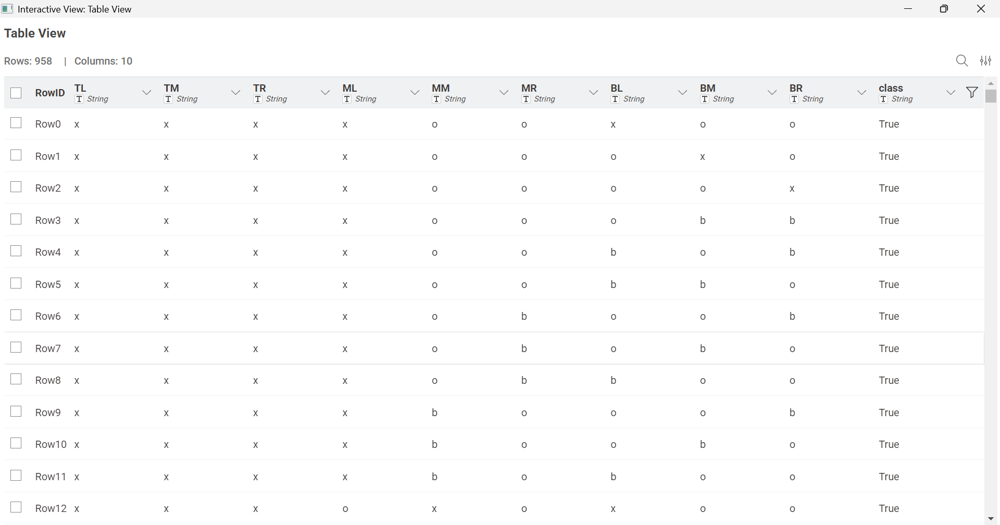
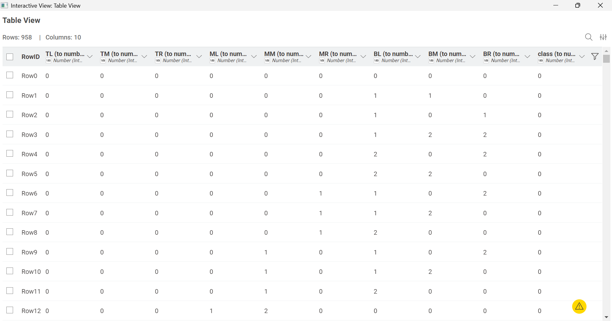
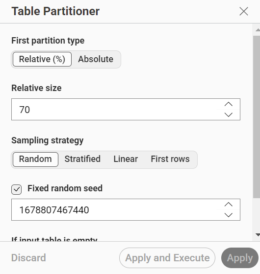
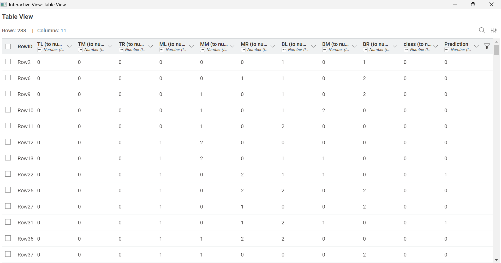
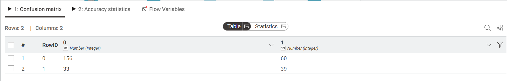
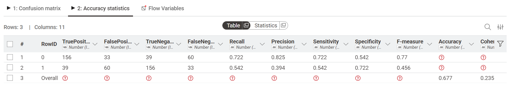
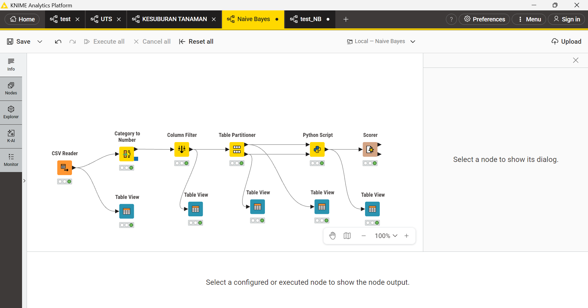

---
jupytext:
  formats: md:myst
  text_representation:
    extension: .md
    format_name: myst
    format_version: 0.13
    jupytext_version: 1.11.5
kernelspec:
  display_name: Python 3
  language: python~
  name: python3
---

# Analisis Data Menggunakan Naive Bayes

## Dataset
Dataset yang digunakan untuk klasifikasi menggunakan metode Naive Bayes adalah `Tic-Tac-Toe Endgame Dataset`. Anda dapat merujuk secara langsung pada file data yang digunakan, yaitu `tic-tac-toe.csv`. Dataset ini merepresentasikan kumpulan semua kemungkinan konfigurasi papan permainan Tic-Tac-Toe di akhir permainan. Tugas utamanya adalah memprediksi apakah pemain pertama (yang menggunakan simbol 'x') memiliki status kemenangan yang sah atau tidak. 

Link : [Tic-Tac-Toe Endgame Dataset](https://www.kaggle.com/datasets/somesh24/tictactoe)

Secara struktural, dataset pada file `tic-tac-toe.csv` ini memiliki **958 baris data**, dengan **9 fitur prediktor** yang semuanya bertipe kategorikal (string), serta **1 label target** bernama `class` yang memiliki nilai boolean (`True` jika 'x' menang, dan `False` jika 'x' kalah atau seri). Semua fitur mewakili kesembilan kotak pada papan permainan Tic-Tac-Toe.

Berikut adalah seluruh fitur beserta nilai kategorinya:

| No | Nama Fitur | Deskripsi Posisi Papan | Nilai Kategori |
|----|------------|------------------------|----------------|
| 1  | TL         | Top-Left (Kiri Atas)   | x, o, b (blank/kosong) |
| 2  | TM         | Top-Middle (Tengah Atas) | x, o, b (blank/kosong) |
| 3  | TR         | Top-Right (Kanan Atas) | x, o, b (blank/kosong) |
| 4  | ML         | Middle-Left (Kiri Tengah) | x, o, b (blank/kosong) |
| 5  | MM         | Middle-Middle (Tengah Pusat) | x, o, b (blank/kosong) |
| 6  | MR         | Middle-Right (Kanan Tengah) | x, o, b (blank/kosong) |
| 7  | BL         | Bottom-Left (Kiri Bawah) | x, o, b (blank/kosong) |
| 8  | BM         | Bottom-Middle (Tengah Bawah)| x, o, b (blank/kosong) |
| 9  | BR         | Bottom-Right (Kanan Bawah) | x, o, b (blank/kosong) |
| 10 | class      | Target Kelas (Kemenangan X) | True (Menang), False (Kalah/Seri) |

## Transformasi Data
Sama halnya dengan pengolahan teks pada umumnya, algoritma klasifikasi *Machine Learning* seperti Categorical Naive Bayes tidak dapat memproses huruf alfabet (`x`, `o`, `b`) secara langsung. Model matematis membutuhkan input berupa angka. Oleh karena itu, tahap *preprocessing* yang sangat krusial di sini adalah **Normalisasi menggunakan Encoding**.

Encoding pada dataset ini akan mengubah nilai kategorikal huruf menjadi nilai numerik diskrit (misalnya `b` menjadi 0, `o` menjadi 1, dan `x` menjadi 2). Target kelas (`True` / `False`) juga dikonversi menjadi representasi numerik biner (1 / 0). Proses ini sangat penting agar probabilitas kondisi di setiap kotak papan dapat dikalkulasi secara matematis oleh algoritma.

Berikut merupakan dataset sebelum dilakukan proses encoding:


Dataset setelah dilakukan encoding:


## Partisi
Sebelum perhitungan probabilitas Naive Bayes dijalankan, dataset perlu dipartisi (dibagi) menjadi dua kelompok utama: **Data Training** dan **Data Testing**. Partisi ini bertujuan untuk memastikan model belajar dari satu porsi data, dan kemudian diuji kualitasnya pada data yang benar-benar belum pernah ia lihat sebelumnya guna menghindari bias atau *overfitting*.

Data training di sini menggunakan proporsi **70%** dari total dataset (sekitar 670 baris), yang digunakan algoritma untuk mempelajari pola kemenangan permainan. Sisanya sebanyak **30%** (sekitar 288 baris) digunakan sebagai data testing untuk mengevaluasi akurasi tebakan model.



## Implementasi Knime Menggunakan library scikit-learn
Implementasi logika algoritma ini dilakukan menggunakan perangkat lunak visual KNIME yang dikombinasikan dengan lingkungan eksekusi Python (`Python Script Node`). Perhitungan inti algoritma dijalankan dengan memanggil kelas `CategoricalNB` dari modul `scikit-learn`. 

Pada pengaturan node:
* `df_train` mengambil aliran data dari port bagian atas (berisi 70% data training).
* `df_test` mengambil aliran data dari port bagian bawah (berisi 30% data testing).

Berbeda dengan beberapa dataset lain yang menempatkan target prediksi di awal, file `tic-tac-toe.csv` menempatkan kolom target (`class`) di urutan paling akhir, sehingga logika pemisahan kolom pada *script* disesuaikan (`iloc[:, :-1]` untuk fitur dan `iloc[:, -1]` untuk target).

### Script Python
```{code-cell}
:tags: [skip-execution]
import knime.scripting.io as knio
from sklearn.naive_bayes import CategoricalNB

# 1. Mengambil Data Training dari Port Atas (70%)
df_train = knio.input_tables[0].to_pandas()

# 2. Mengambil Data Testing dari Port Bawah (30%)
df_test = knio.input_tables[1].to_pandas()

# 3. Memisahkan Fitur (X) dan Target (y) pada Data Training
# Mengambil semua kolom kecuali kolom terakhir sebagai fitur
X_train = df_train.iloc[:, :-1].values
# Mengambil kolom paling terakhir (class) sebagai target
y_train = df_train.iloc[:, -1].values

# 4. Memisahkan Fitur pada Data Testing (Tanpa menyertakan jawaban)
X_test = df_test.iloc[:, :-1].values

# 5. Inisialisasi dan Pelatihan Model Naive Bayes Kategorikal
model = CategoricalNB()
model.fit(X_train, y_train)

# 6. Melakukan Prediksi terhadap 30% data yang belum pernah dilihat model
predictions = model.predict(X_test)

# 7. Menempelkan hasil tebakan prediksi ke tabel testing 
# agar bisa dievaluasi oleh node Scorer di KNIME
df_test['Prediction'] = predictions

# 8. Meneruskan hasil ujian keluar dari Python Node ke dalam workflow KNIME
knio.output_tables[0] = knio.Table.from_pandas(df_test)
```

### Hasil Prediksi dan Evaluasi Model
Setelah script tersebut dijalankan, maka akan menghasilkan prediction sebagai berikut:


### Confusion Matriks


### Nilai Akurasi


### Implementasi KNime
