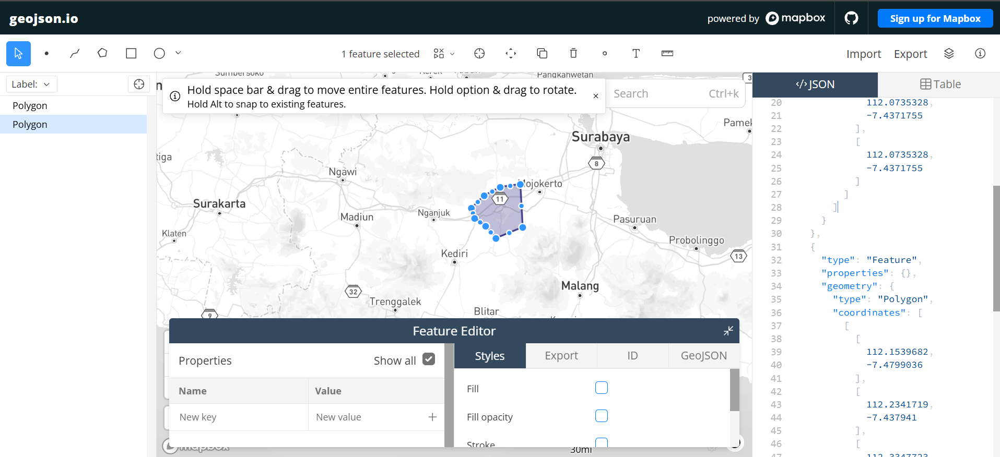
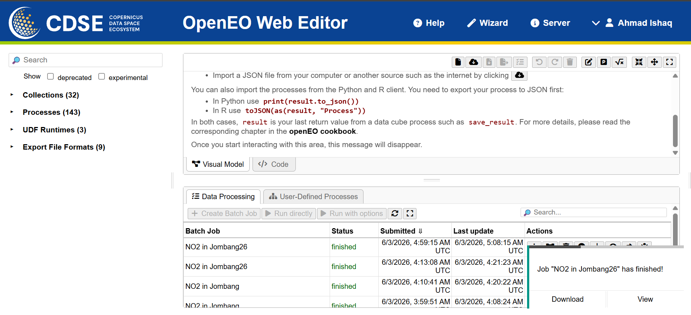
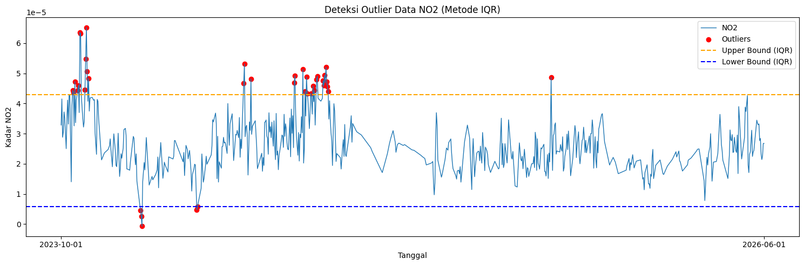
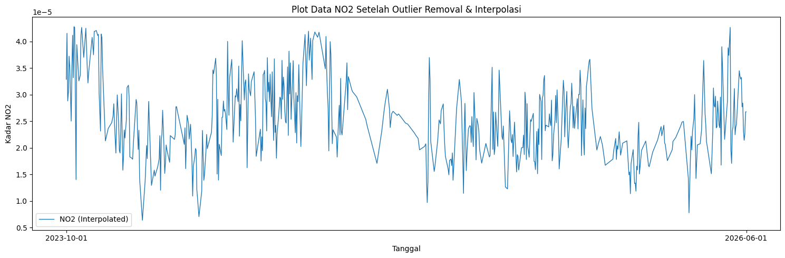
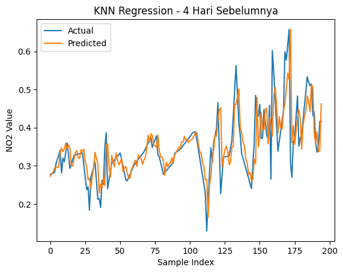
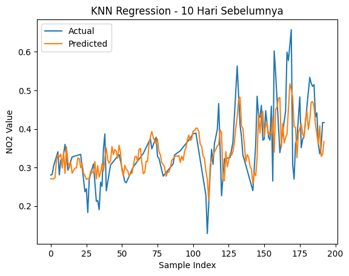

---
jupytext:
  formats: md:myst
  text_representation:
    extension: .md
    format_name: myst
    format_version: 0.13
    jupytext_version: 1.11.5
kernelspec:
  display_name: Python 3
  language: python~
  name: python3
---

# Peramalan Kadar NO₂ di Daerah Jombang26

## Latar Belakang

Peningkatan aktivitas industri, transportasi, serta pertumbuhan populasi yang pesat telah menyebabkan peningkatan signifikan terhadap tingkat pencemaran udara di berbagai wilayah. Salah satu polutan udara utama yang menjadi perhatian adalah Nitrogen Dioksida (NO₂), yaitu gas beracun yang dihasilkan terutama dari proses pembakaran bahan bakar fosil seperti kendaraan bermotor, pembangkit listrik, dan kegiatan industri.

NO₂ memiliki dampak serius terhadap kesehatan manusia, seperti gangguan pernapasan, iritasi paru-paru, serta memperburuk penyakit asma dan bronkitis. Selain itu, NO₂ juga berkontribusi terhadap pembentukan hujan asam dan penurunan kualitas lingkungan secara keseluruhan.

Wilayah Jombang26 merupakan salah satu area yang perlu dimonitor tingkat pencemaran NO₂-nya. Dengan menggunakan data time series harian kadar NO₂ dari satelit Sentinel-5P yang diakses melalui platform Copernicus, kita dapat melakukan peramalan kadar NO₂ untuk membantu dalam pengambilan keputusan terkait manajemen kualitas udara.

Pada proyek ini, kita akan melakukan analisis dan peramalan kadar NO₂ di daerah Jombang26 menggunakan algoritma KNN Regression dengan mempertimbangkan berbagai periode historis (4 hari, 10 hari, dan 30 hari sebelumnya) untuk menentukan model terbaik.

---

## 1. Pengumpulan Data

### Sumber Data

Data kadar NO₂ dikumpulkan dari sumber website [https://dataspace.copernicus.eu/](https://dataspace.copernicus.eu/). Dokumentasi lengkap cara pengambilan data dapat dilihat di [https://documentation.dataspace.copernicus.eu/notebook-samples/openeo/NO2Covid.html](https://documentation.dataspace.copernicus.eu/notebook-samples/openeo/NO2Covid.html).

### Proses Pengambilan Data dengan OpenEO

Untuk mengambil data NO₂ di daerah Jombang26, kami menggunakan Python dengan library OpenEO. Berikut adalah langkah-langkahnya:

#### 1. Koneksi ke OpenEO

```python
import openeo

connection = openeo.connect("openeo.dataspace.copernicus.eu").authenticate_oidc()
```

Saat menjalankan baris kode di atas, Anda akan diminta untuk melakukan autentikasi melalui device code flow dengan login menggunakan akun Copernicus Anda.

#### 2. Definisikan Area of Interest (AOI)

Wilayah Jombang26 didefinisikan dengan koordinat geografis berikut:

```python
aoi = {
    "type": "Polygon",
    "coordinates": [
          [
            [
              112.0735328,
              -7.4371755
            ],
            [
              112.0735328,
              -7.4371755
            ],
            [
              112.0735328,
              -7.4371755
            ],
            [
              112.0735328,
              -7.4371755
            ]
          ]
        ]
}

s5post = connection.load_collection(
    "SENTINEL_5P_L2",
    temporal_extent=["2023-10-01", "2026-06-01"],
    spatial_extent={
        "west": 112.00,
        "south": -7.50,
        "east": 112.15,
        "north": -7.40
    },
    bands=["NO2"],
)
```

**Penjelasan:**

- Data diambil dari koleksi Sentinel-5P Level 2 (SENTINEL_5P_L2)
- Periode waktu: 1 Oktober 2023 hingga 1 Juni 2026 (sekitar 2.5 tahun)
- Area spatial: Wilayah Jombang dengan rentang longitude 112.00-112.15 dan latitude -7.50 hingga -7.40
- Band yang diambil: hanya NO₂

#### 3. Agregasi Temporal dan Spatial

```python
# Agregasi harian untuk menghindari multiple data per hari
s5p_no2_daily = s5post.aggregate_temporal_period(reducer="mean", period="day")

# Agregasi spatial untuk menghasilkan mean timeseries data
s5p_no2_aoi = s5p_no2_daily.aggregate_spatial(reducer="mean", geometries=aoi)
```

Proses ini mengubah data mentah yang memiliki multiple sampel per hari menjadi satu nilai rata-rata per hari.



#### 4. Eksekusi Batch Job

```python
job = s5post.execute_batch(title="NO2 in Jombang26", outputfile="NO2Jombang26.nc")
```

Proses pengambilan data akan memakan waktu beberapa menit hingga jam, tergantung beban server Copernicus. Output akan berupa file NetCDF (`.nc`) yang berisi data NO₂ dalam format multi-dimensi.



---

## 2. Preprocessing Data

Setelah data diunduh, langkah selanjutnya adalah melakukan preprocessing untuk membersihkan dan mempersiapkan data agar siap untuk modeling.

### a. Ekstraksi Data dari File NetCDF

File `.nc` yang diunduh memiliki struktur multi-dimensi. Kita perlu mengekstrak kolom tanggal dan NO₂:

```python
import netCDF4
import numpy as np
import pandas as pd

file_path = "NO2Jombang26.nc"
ds = netCDF4.Dataset(file_path)

# Lihat seluruh variabel yang tersedia
print("📦 Variabel dalam file:")
print(ds.variables.keys())

# Ambil NO2
no2 = ds.variables["NO2"][:]

# Ambil Time
time = ds.variables["t"][:]

# Konversi waktu ke format tanggal
try:
    time_units = ds.variables["t"].units
    dates = netCDF4.num2date(time, units=time_units)
except Exception:
    dates = time
```

Struktur data NO₂ yang dihasilkan adalah 3 dimensi: `[waktu, y_grid, x_grid]` dengan dimensi temporal, latitude grid, dan longitude grid.

### b. Mengatasi Missing Value menggunakan Interpolasi Linear

Data NO₂ sering memiliki missing value (ditandai dengan `--` atau `NaN`) akibat kondisi awan atau sensor yang tidak bekerja optimal. Untuk menangani ini, kami menggunakan metode Interpolasi Linear:

```python
# Interpolasi Linear untuk mengatasi missing value
no2_filled = np.zeros_like(no2)
no2_filled = no2_filled.filled(0)

# Loop tiap grid (y,x)
for i in range(no2.shape[1]):     # grid baris
    for j in range(no2.shape[2]): # grid kolom
        series = pd.Series(no2[:, i, j])
        no2_filled[:, i, j] = series.interpolate(method='linear', limit_direction='both').to_numpy()
```

Dengan metode ini, nilai missing akan diisi dengan interpolasi linear dari nilai-nilai sekitarnya.

### c. Rata-rata Data dan Ubah Format Datetime

Data grid spatial dirata-ratakan untuk menghasilkan satu nilai per hari. Selain itu, format datetime diubah menjadi format tanggal sederhana (YYYY-MM-DD):

```python
new_dates = []
new_no2 = []
for i in range(len(dates)):
    # Ubah format datetime
    new_date = dates[i].strftime('%Y-%m-%d')
    new_dates.append(new_date)
    new_no2.append(np.mean(no2_filled[i]))

df = pd.DataFrame({
    "date": dates,
    "NO2": new_no2
})

# Simpan ke CSV
df.to_csv("NO2_Jombang26_timeseries.csv", index=False)
```

Hasil: DataFrame dengan 2 kolom - `date` dan `NO2` dengan nilai NO₂ yang sudah di-rata-ratakan per hari.

### d. Pengecekan Missing Value Data Harian pada CSV

Setelah data berbentuk CSV, kita periksa apakah ada hari yang hilang dalam rentang periode pengambilan data:

```python
import pandas as pd
import numpy as np

df = pd.read_csv("NO2_Jombang26_timeseries.csv")

# Pastikan kolom 'date' bertipe datetime
df['date'] = pd.to_datetime(df['date'])

# Buat rentang tanggal lengkap
start_date = "2023-10-01"
end_date = "2026-06-01"
full_range = pd.date_range(start=start_date, end=end_date, freq='D')

# Cek tanggal yang hilang
missing_dates = full_range.difference(df['date'])

print(f"Jumlah hari missing: {len(missing_dates)}")
print("Daftar tanggal missing:")
print(missing_dates)
```

Jika terdapat hari yang hilang, kita lanjutkan ke langkah berikutnya untuk melakukan interpolasi pada data time series harian.

### e. Interpolasi Missing Value Harian

```python
import pandas as pd

# Pastikan datetime dan sorting
df['date'] = pd.to_datetime(df['date'])
df = df.sort_values('date')

# Buat rentang tanggal lengkap
full_range = pd.date_range(start="2023-10-01", end="2026-06-01", freq='D')

# Reindex agar tanggal yang hilang muncul sebagai NaN
df = df.set_index('date').reindex(full_range)
df.index.name = 'date'

# Interpolasi linear berdasarkan indeks waktu
df['NO2'] = df['NO2'].interpolate(method='time')

# Jika masih ada NaN di bagian awal/akhir bisa gunakan forward/backward fill
df['NO2'] = df['NO2'].fillna(method='bfill').fillna(method='ffill')

# Simpan kembali ke CSV
df.to_csv("no2_timeseries_interpolated.csv")
```

Proses ini memastikan bahwa data time series harian tidak memiliki celah temporal yang bisa mempengaruhi analisis.

### f. Deteksi Outlier menggunakan Metode IQR

Outlier adalah nilai yang sangat berbeda dari mayoritas data. Deteksi outlier penting untuk mengidentifikasi anomali data yang mungkin disebabkan oleh error sensor atau kondisi ekstrem:

```python
import pandas as pd
import numpy as np
import matplotlib.pyplot as plt

df = pd.read_csv("no2_timeseries_interpolated.csv")
df['date'] = pd.to_datetime(df['date'])

# Hitung IQR (Interquartile Range)
Q1 = df['NO2'].quantile(0.25)
Q3 = df['NO2'].quantile(0.75)
IQR = Q3 - Q1

lower_bound = Q1 - 1.5 * IQR
upper_bound = Q3 + 1.5 * IQR

# Filter outlier
outliers_iqr = df[(df['NO2'] < lower_bound) | (df['NO2'] > upper_bound)]

print("Jumlah Outlier (IQR):", len(outliers_iqr))
print(outliers_iqr[['date', 'NO2']].head())
```

Visualisasi outlier:

```python
# === Visualisasi ===
plt.figure(figsize=(15,5))
plt.plot(df['date'], df['NO2'], label="NO2", linewidth=1)

# Titik Outlier
plt.scatter(outliers_iqr['date'], outliers_iqr['NO2'],
            color='red', marker='o', label="Outliers")

# Garis batas atas & bawah
plt.axhline(upper_bound, color='orange', linestyle='dashed', label="Upper Bound (IQR)")
plt.axhline(lower_bound, color='blue', linestyle='dashed', label="Lower Bound (IQR)")

plt.title("Deteksi Outlier Data NO2 (Metode IQR)")
plt.xlabel("Tanggal")
plt.ylabel("Kadar NO2")
plt.legend()
plt.tight_layout()
plt.xticks(
    ticks=[df['date'].iloc[0], df['date'].iloc[-1]],
    labels=[df['date'].iloc[0].strftime('%Y-%m-%d'),
            df['date'].iloc[-1].strftime('%Y-%m-%d')]
)
plt.show()
```


### g. Handling Outlier dengan Interpolasi

Karena data ini merupakan time series, outlier yang terdeteksi akan dihapus kemudian diisi ulang menggunakan Interpolasi Linear:

```python
# Tandai outlier menjadi NaN
df['NO2_cleaned'] = df['NO2'].mask((df['NO2'] < lower_bound) | (df['NO2'] > upper_bound))

print("Jumlah nilai yang dinyatakan sebagai outlier:", df['NO2_cleaned'].isna().sum())

# Interpolasi linear untuk mengisi kembali nilai outlier
df['NO2_filled'] = df['NO2_cleaned'].interpolate(method='linear')

# Jika masih tersisa NaN di ujung data, isi dengan forward/backward fill
df['NO2_filled'] = df['NO2_filled'].bfill().ffill()

print("Jumlah missing setelah interpolasi:", df['NO2_filled'].isna().sum())
```

Visualisasi data setelah cleaning:

```python
plt.figure(figsize=(15,5))
# Plot data hasil interpolasi
plt.plot(df['date'], df['NO2_filled'], label="NO2 (Interpolated)", linewidth=1)
# Tampilkan hanya tanggal awal dan akhir di sumbu X
plt.xticks(
    ticks=[df['date'].iloc[0], df['date'].iloc[-1]],
    labels=[df['date'].iloc[0].strftime('%Y-%m-%d'),
            df['date'].iloc[-1].strftime('%Y-%m-%d')]
)
plt.title("Plot Data NO2 Setelah Outlier Removal & Interpolasi")
plt.xlabel("Tanggal")
plt.ylabel("Kadar NO2")
plt.legend()
plt.tight_layout()
plt.show()
```



### h. Normalisasi Data

Karena kita menggunakan model KNN Regression, normalisasi data sangat penting agar semua fitur memiliki skala yang sama. Kami menggunakan MinMax Scaler untuk mengubah nilai menjadi range 0-1:

```python
from sklearn.preprocessing import MinMaxScaler
import pandas as pd

scaler = MinMaxScaler()
df['NO2_scaled'] = scaler.fit_transform(df[['NO2_filled']])
```

Setelah normalisasi, semua nilai NO₂ akan berada di range 0-1:

```
         date  NO2_filled  NO2_scaled
0  2023-10-01    0.000027    0.238203
1  2023-10-02    0.000024    0.192840
2  2023-10-03    0.000024    0.196854
3  2023-10-04    0.000021    0.149560
4  2023-10-05    0.000021    0.154247
```

---

## 3. Modeling menggunakan KNN Regression

KNN (K-Nearest Neighbors) Regression adalah algoritma yang sederhana namun efektif untuk prediksi time series. Idenya adalah memprediksi nilai pada hari ke-t berdasarkan k nilai tetangga terdekat dari hari-hari sebelumnya.

### a. Uji Korelasi Data

Sebelum modeling, kita ubah data unsupervised time series menjadi data supervised dengan membuat fitur dari nilai-nilai historis. Kemudian kita uji korelasi antara fitur historis dengan nilai target (NO₂ pada hari ke-t):

```python
import pandas as pd

def create_supervised(data, n_lag=4):
    df_supervised = pd.DataFrame()

    # Membuat fitur t-n_lag sampai t-1
    for i in range(n_lag, 0, -1):
        df_supervised[f'NO2(t-{i})'] = data.shift(i)

    # Label hari H (target)
    df_supervised['NO2(t)'] = data

    # Hapus baris yang masih mengandung NaN akibat shift
    df_supervised.dropna(inplace=True)

    return df_supervised

# Uji korelasi untuk 30 hari sebelumnya
supervised_df30 = create_supervised(df['NO2_scaled'], n_lag=30)

# Ambil semua lag dan kolom target
lag_cols = supervised_df30.drop(columns="NO2(t)").columns
correlations = supervised_df30[lag_cols].corrwith(supervised_df30['NO2(t)'])

# Tampilkan nilai korelasi
print(correlations)
```

**Output Contoh:**

```
NO2(t-30)    0.442365
NO2(t-29)    0.454480
...
NO2(t-5)     0.491515
NO2(t-4)     0.523820
NO2(t-3)     0.593839
NO2(t-2)     0.675955
NO2(t-1)     0.796441
```

Analisis korelasi menunjukkan bahwa semakin dekat hari historis ke hari target (semakin kecil lag), semakin kuat korelasinya. Fitur dengan korelasi > 0.5 dianggap memiliki pengaruh signifikan terhadap prediksi.

### b. Transformasi Data Supervised

Berdasarkan hasil uji korelasi, kami membuat beberapa dataset supervised dengan lag berbeda untuk membandingkan performa model:

```python
# Dataset dengan 4 hari sebelumnya
supervised_df4 = create_supervised(df['NO2_scaled'], n_lag=4)
print("Shape 4 hari:", supervised_df4.shape)  # Contoh: (727, 5)

# Dataset dengan 10 hari sebelumnya
supervised_df10 = create_supervised(df['NO2_scaled'], n_lag=10)
print("Shape 10 hari:", supervised_df10.shape)  # Contoh: (721, 11)

# Dataset dengan 30 hari sebelumnya
supervised_df30 = create_supervised(df['NO2_scaled'], n_lag=30)
print("Shape 30 hari:", supervised_df30.shape)  # Contoh: (701, 31)
```

Struktur data supervised dengan 4 hari lag:

```
   NO2(t-4)  NO2(t-3)  NO2(t-2)  NO2(t-1)    NO2(t)
0   0.238203  0.192840  0.196854  0.149560  0.154247
1   0.192840  0.196854  0.149560  0.154247  0.185625
2   0.196854  0.149560  0.154247  0.185625  0.152010
```

### c. Training dan Evaluasi Model KNN

```python
from sklearn.neighbors import KNeighborsRegressor
from sklearn.model_selection import train_test_split
from sklearn.metrics import mean_squared_error, r2_score
import numpy as np

def MAPE(y_true, y_pred):
    y_true, y_pred = np.array(y_true), np.array(y_pred)
    # Hindari pembagian dengan nol
    nonzero = y_true != 0
    return np.mean(np.abs((y_true[nonzero] - y_pred[nonzero]) / y_true[nonzero])) * 100

def train_knn(df_supervised, model_name="", n_neighbors=5):
    # Pisahkan fitur & label
    X = df_supervised.drop(columns=['NO2(t)']).values
    y = df_supervised['NO2(t)'].values

    # Split data 80/20
    X_train, X_test, y_train, y_test = train_test_split(
        X, y, test_size=0.2, shuffle=False
    )

    # Model KNN dengan k neighbors
    knn = KNeighborsRegressor(n_neighbors=n_neighbors)
    knn.fit(X_train, y_train)

    # Prediksi
    y_pred = knn.predict(X_test)

    # Evaluasi
    mse = mean_squared_error(y_test, y_pred)
    rmse = np.sqrt(mse)
    r2 = r2_score(y_test, y_pred)
    mape = MAPE(y_test, y_pred)

    print(f"\n=== {model_name} ===")
    print(f"Train Size: {len(X_train)} — Test Size: {len(X_test)}")
    print(f"RMSE: {rmse:.6f}")
    print(f"R² Score: {r2:.4f}")
    print(f"MAPE: {mape:.4f}%")

    return knn, y_test, y_pred


# Train model untuk berbagai lag
knn_4, y_test_4, y_pred_4 = train_knn(supervised_df4, "KNN - 4 Hari Sebelumnya")
knn_10, y_test_10, y_pred_10 = train_knn(supervised_df10, "KNN - 10 Hari Sebelumnya")
knn_30, y_test_30, y_pred_30 = train_knn(supervised_df30, "KNN - 30 Hari Sebelumnya")
```

**Output Contoh:**

```
=== KNN - 4 Hari Sebelumnya ===
Train Size: 581 — Test Size: 146
RMSE: 0.065436
R² Score: 0.1395
MAPE: 61.0780%

=== KNN - 10 Hari Sebelumnya ===
Train Size: 576 — Test Size: 145
RMSE: 0.067567
R² Score: 0.0886
MAPE: 64.6611%

=== KNN - 30 Hari Sebelumnya ===
Train Size: 560 — Test Size: 141
RMSE: 0.074803
R² Score: -0.0875
MAPE: 72.2295%
```

### d. Visualisasi Hasil Prediksi

Visualisasi perbandingan nilai actual vs predicted untuk masing-masing model:

#### 4 Hari Sebelumnya:

```python
import matplotlib.pyplot as plt
import numpy as np

plt.figure(figsize=(12, 5))
plt.plot(np.arange(len(y_test_4)), y_test_4, label="Actual", linewidth=2)
plt.plot(np.arange(len(y_pred_4)), y_pred_4, label="Predicted", linewidth=2)
plt.title("KNN Regression - 4 Hari Sebelumnya")
plt.xlabel("Sample Index")
plt.ylabel("NO2 Value (Normalized)")
plt.legend()
plt.grid(True, alpha=0.3)
plt.tight_layout()
plt.show()
```



#### 10 Hari Sebelumnya:

```python
plt.figure(figsize=(12, 5))
plt.plot(np.arange(len(y_test_10)), y_test_10, label="Actual", linewidth=2)
plt.plot(np.arange(len(y_pred_10)), y_pred_10, label="Predicted", linewidth=2)
plt.title("KNN Regression - 10 Hari Sebelumnya")
plt.xlabel("Sample Index")
plt.ylabel("NO2 Value (Normalized)")
plt.legend()
plt.grid(True, alpha=0.3)
plt.tight_layout()
plt.show()
```


### e. Analisis dan Kesimpulan

Berdasarkan hasil evaluasi model KNN Regression pada data NO₂ Jombang26, dapat diambil beberapa kesimpulan:

**1. Pengaruh Jumlah Lag terhadap Performa Model:**

- Model dengan 4 hari sebelumnya menghasilkan **RMSE terkecil (0.065436)** dan **R² positif (0.1395)**, menunjukkan bahwa model mampu menjelaskan sekitar 13.95% variabilitas data target.
- Peningkatan lag menjadi 10 hari menyebabkan peningkatan RMSE menjadi 0.067567 dan penurunan R² menjadi 0.0886.
- Ketika lag ditambah menjadi 30 hari, performa model semakin menurun dengan RMSE 0.074803 dan R² bernilai negatif (-0.0875).

**2. Akurasi Prediksi:**

- Nilai MAPE (Mean Absolute Percentage Error) yang cukup tinggi pada semua model (lebih dari 60%) mengindikasikan bahwa akurasi prediksi masih rendah.
- Terdapat deviasi besar antara nilai prediksi dan nilai aktual, yang menunjukkan bahwa KNN Regression mungkin bukan model optimal untuk data NO₂ time series ini.

**3. Overfitting dan Underfitting:**

- Penambahan fitur historis (lag) justru menyebabkan penurunan performa model, mengindikasikan adanya fenomena **overfitting**.
- Model dengan lag yang lebih banyak tidak mampu generalisasi dengan baik pada data test.

**4. Rekomendasi untuk Peningkatan Model:**

- Coba model machine learning lainnya seperti ARIMA, LSTM (Long Short-Term Memory), atau ensemble methods (Random Forest, Gradient Boosting).
- Lakukan feature engineering tambahan seperti incorporating seasonal patterns atau menggunakan exogenous variables.
- Pertimbangkan untuk mengubah strategi preprocessing atau hyperparameter tuning (misalnya mencoba nilai k yang berbeda pada KNN).
- Gunakan teknik cross-validation yang lebih sophisticated untuk evaluasi model yang lebih robust.

---

## Referensi

- Copernicus Data Space Ecosystem. (2025). Retrieved from https://dataspace.copernicus.eu/
- OpenEO Documentation. Retrieved from https://documentation.dataspace.copernicus.eu/
- Scikit-learn Documentation. Retrieved from https://scikit-learn.org/

---

**Catatan:** Dokumentasi ini dibuat berdasarkan analisis data NO₂ Jombang26 dari tanggal 1 Oktober 2023 hingga 1 Juni 2026 menggunakan metodologi yang sama dengan referensi peramalan NO₂ di daerah Bangkalan.
