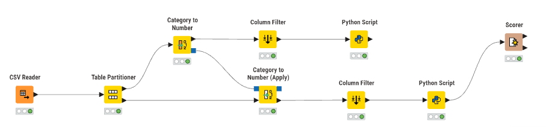
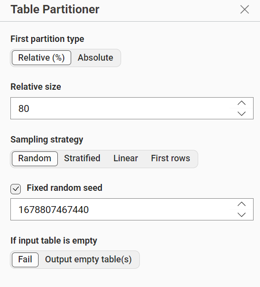
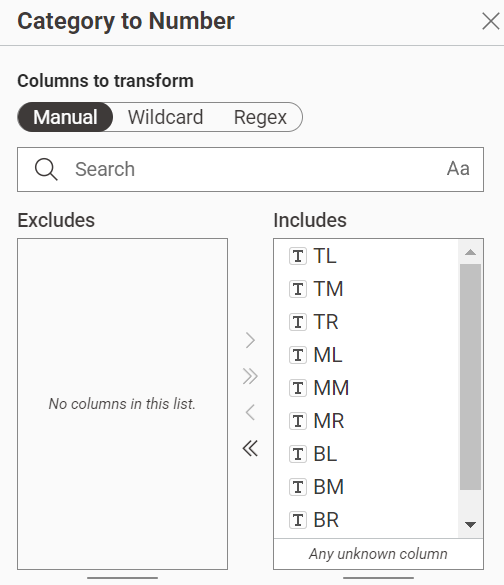
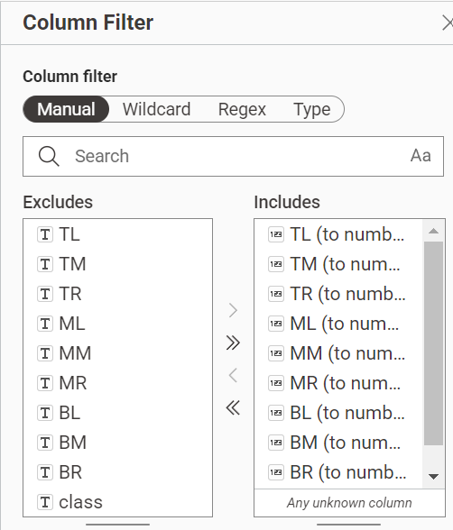
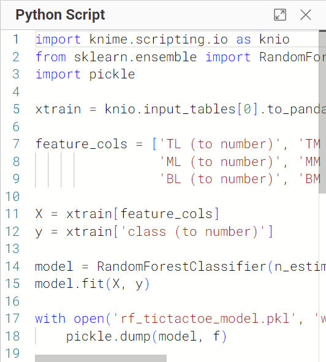
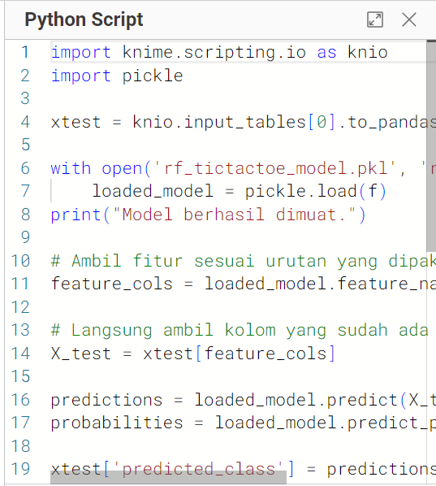
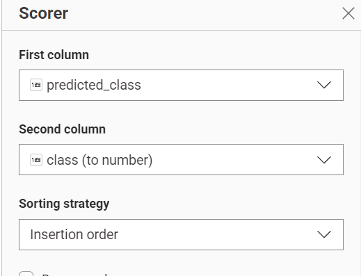
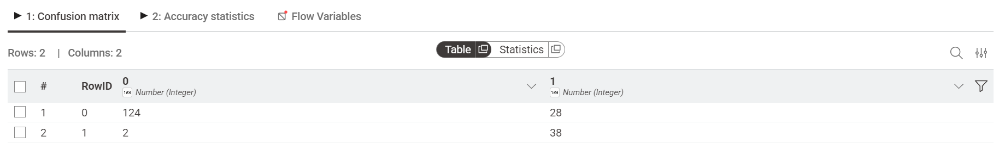
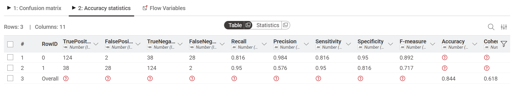

---
jupytext:
  formats: md:myst
  text_representation:
    extension: .md
    format_name: myst
    format_version: 0.13
    jupytext_version: 1.11.5
kernelspec:
  display_name: Python 3
  language: python~
  name: python3
---

# Random-Forest

## Dataset

Dataset yang digunakan adalah **Tic-Tac-Toe Endgame Dataset**, sebuah dataset klasik dari UCI Machine Learning Repository yang merepresentasikan semua kemungkinan posisi akhir papan permainan Tic-Tac-Toe (Catur Kuadrat 3×3) antara dua pemain: **x** dan **o**.

**Link:** [Tic-Tac-Toe Endgame Dataset – UCI ML Repository](https://archive.ics.uci.edu/dataset/101/tic+tac+toe+endgame)

Tujuan dataset ini adalah memprediksi apakah pemain **x** menang atau tidak berdasarkan konfigurasi akhir papan permainan. Dataset ini sering dipakai untuk menguji algoritma klasifikasi karena meskipun fiturnya sederhana (hanya 9 kotak), pola kemenangannya tidak trivial dan memerlukan kombinasi kondisi tertentu.

Dataset memiliki:

- **958 baris** data, masing-masing merepresentasikan satu posisi akhir papan permainan
- **9 fitur** bertipe kategorikal, masing-masing mewakili satu kotak pada papan 3×3
- **1 label** bernama `class` dengan 2 nilai:
  - `True` → pemain **x menang** (*positive*)
  - `False` → pemain **x tidak menang** (*negative*, bisa seri atau kalah)

Data tidak seimbang: sebanyak **626 sampel** berlabel `True` dan **332 sampel** berlabel `False`, sehingga perlu diperhatikan saat evaluasi model.

Berikut penjelasan seluruh fitur beserta nilai kategorinya:

| No | Nama Fitur | Posisi di Papan | Nilai Kategori |
|---|---|---|---|
| 1 | TL | Top-Left (kiri atas) | x, o, b (kosong) |
| 2 | TM | Top-Middle (tengah atas) | x, o, b |
| 3 | TR | Top-Right (kanan atas) | x, o, b |
| 4 | ML | Middle-Left (kiri tengah) | x, o, b |
| 5 | MM | Middle-Middle (pusat papan) | x, o, b |
| 6 | MR | Middle-Right (kanan tengah) | x, o, b |
| 7 | BL | Bottom-Left (kiri bawah) | x, o, b |
| 8 | BM | Bottom-Middle (tengah bawah) | x, o, b |
| 9 | BR | Bottom-Right (kanan bawah) | x, o, b |

Setiap kotak pada papan hanya bisa berisi tiga kemungkinan nilai: `x` (diisi pemain x), `o` (diisi pemain o), atau `b` (*blank*, artinya kotak tersebut kosong atau tidak relevan untuk posisi akhir tersebut).

---

## Implementasi Pada KNIME

Workflow ini dibangun di KNIME untuk membangun model klasifikasi **Random Forest** menggunakan Python (`scikit-learn`). Tujuannya adalah memprediksi apakah pemain `x` berhasil menang berdasarkan konfigurasi papan permainan Tic-Tac-Toe di akhir permainan.

Random Forest dipilih karena mampu menangani data kategorikal yang telah dienkode, tahan terhadap overfitting dibanding Decision Tree tunggal, dan bekerja baik pada dataset kecil-menengah seperti ini.

### Workflow



Workflow terdiri dari node-node berikut:

1. **CSV Reader** — membaca file `tic-tac-toe.csv` dari penyimpanan lokal ke dalam KNIME sebagai tabel data.
2. **Table Partitioner** — membagi dataset menjadi dua bagian: data pelatihan (*training*) dan data pengujian (*testing*) dengan proporsi tertentu.
3. **Category to Number** — mengonversi semua fitur kategorikal (`x`, `o`, `b`) menjadi representasi numerik agar bisa diproses oleh model `scikit-learn`. Node ini diterapkan pada data *training* sekaligus menyimpan pemetaan (*mapping*) konversinya.
4. **Category to Number (Apply)** — menerapkan mapping konversi yang sama (dari node sebelumnya) ke data *testing*. Hal ini penting agar pengkodean antar dua set data tetap konsisten.
5. **Column Filter** — menyaring kolom yang akan diikutsertakan dalam proses pelatihan, membuang kolom yang tidak diperlukan.
6. **Python Script (Training)** — melatih model Random Forest menggunakan data training, kemudian menyimpan model ke file pickle.
7. **Python Script (Testing)** — memuat model yang sudah tersimpan dan menggunakannya untuk memprediksi label pada data testing.
8. **Scorer** — mengevaluasi performa model dengan membandingkan hasil prediksi terhadap label sebenarnya.

---

### Partisi



Dataset dibagi dengan proporsi berikut:

- **80%** → data training (sekitar 766 baris)
- **20%** → data testing (sekitar 192 baris)

Pembagian 80/20 merupakan proporsi umum yang memberikan cukup data untuk melatih model sekaligus menyisakan data yang representatif untuk evaluasi. Karena dataset ini relatif kecil (958 baris), proporsi ini dipilih agar model mendapat cukup contoh dari kedua kelas selama pelatihan.

---

### Preprocessing: Category to Number



Seluruh 9 fitur pada dataset Tic-Tac-Toe bertipe **kategorikal** dengan nilai `x`, `o`, dan `b`. Algoritma berbasis pohon dalam `scikit-learn` mengharuskan input berupa nilai numerik, sehingga perlu dilakukan enkoding terlebih dahulu.

Proses konversinya:

- `x` → misalnya dienkode menjadi `0`
- `o` → misalnya dienkode menjadi `1`
- `b` → misalnya dienkode menjadi `2`

Node **Category to Number** digunakan pada data *training* dan menyimpan tabel pemetaan ini. Kemudian node **Category to Number (Apply)** menggunakan pemetaan yang sama saat memproses data *testing*, sehingga tidak terjadi inkonsistensi representasi antar dua set data (yang bisa mengakibatkan prediksi salah).

---

### Column Filter



Setelah konversi kategori ke angka, tabel data mungkin memiliki kolom-kolom tambahan dari proses encoding (misalnya kolom asli sebelum diubah). Node **Column Filter** digunakan untuk membuang kolom-kolom yang tidak diperlukan dan hanya meneruskan fitur-fitur yang relevan ke node Python Script. Kolom `class` (label) tetap dipertahankan untuk proses pelatihan.

---

### Training: Python Script (Random Forest)



Model Random Forest dilatih menggunakan library `scikit-learn`. Setelah proses pelatihan selesai, model disimpan ke dalam file `.pkl` menggunakan `pickle` supaya bisa dimuat kembali oleh node testing tanpa perlu melatih ulang.

```python
import knime.scripting.io as knio
from sklearn.ensemble import RandomForestClassifier
import pickle
import os

# Ambil data training dari KNIME
xtrain = knio.input_tables[0].to_pandas()

# Pisahkan fitur dan label
X = xtrain.drop(columns=['class_number'])
y = xtrain['class_number']

# Latih model Random Forest
model = RandomForestClassifier(n_estimators=500, max_depth=5, random_state=42)
model.fit(X, y)

# Simpan model ke file pickle
pickle_filename = 'rf_tictactoe_model.pkl'
with open(pickle_filename, 'wb') as file:
    pickle.dump(model, file)

print(f"Model disimpan di: {os.path.abspath(pickle_filename)}")

knio.output_tables[0] = knio.input_tables[0]
```

**Penjelasan setiap baris kode:**

- `knio.input_tables[0].to_pandas()` — mengambil tabel input dari KNIME (data training yang sudah diproses) dan mengonversinya ke DataFrame pandas.
- `X = xtrain.drop(columns=['class_number'])` — memisahkan fitur dari label. Kolom `class_number` adalah hasil enkoding dari label `True`/`False`.
- `model.fit(X, y)` — melatih model dengan data fitur `X` dan label target `y`.
- `pickle.dump(model, file)` — menyimpan objek model ke file biner agar bisa dibuka lagi tanpa proses training ulang.
- `knio.output_tables[0] = knio.input_tables[0]` — meneruskan tabel input ke output tanpa perubahan, sehingga workflow bisa dilanjutkan ke node berikutnya.

**Parameter yang digunakan:**

| Parameter | Nilai | Alasan Pemilihan |
|---|---|---|
| `n_estimators` | 500 | Jumlah pohon yang terbentuk; lebih banyak pohon meningkatkan stabilitas prediksi, namun dengan trade-off waktu komputasi |
| `max_depth` | 5 | Batas kedalaman tiap pohon; nilai moderat mencegah overfitting sekaligus memberi pohon cukup "ruang" untuk menangkap pola kompleks |
| `random_state` | 42 | Seed untuk memastikan hasil bisa direproduksi; setiap run menghasilkan model yang persis sama |

---

### Testing: Python Script (Prediksi)



Setelah model tersimpan, node Python Script kedua bertugas memuat kembali model tersebut dan menggunakannya untuk menghasilkan prediksi pada data testing. Selain prediksi kelas, node ini juga menghitung nilai *confidence* untuk setiap prediksi, yaitu seberapa yakin model terhadap keputusannya.

```python
import knime.scripting.io as knio
import pickle

# Load data testing dari KNIME
xtest = knio.input_tables[0].to_pandas()

# Load model yang sudah dilatih
pickle_filename = 'rf_tictactoe_model.pkl'
with open(pickle_filename, 'rb') as file:
    loaded_model = pickle.load(file)
print("Model berhasil dimuat.")

# Pisahkan fitur dari label
X_test = xtest.drop(columns=['class_number'], errors='ignore')

# Lakukan prediksi
predictions = loaded_model.predict(X_test)
probabilities = loaded_model.predict_proba(X_test)

# Tambahkan hasil ke dataframe
xtest['predicted_class'] = predictions
xtest['confidence'] = probabilities.max(axis=1).round(4)

# Kembalikan output ke KNIME
knio.output_tables[0] = knio.Table.from_pandas(xtest)
```

**Penjelasan setiap baris kode:**

- `pickle.load(file)` — memuat kembali objek model dari file `.pkl`. Model langsung siap digunakan tanpa perlu dilatih ulang.
- `loaded_model.predict(X_test)` — menghasilkan prediksi kelas (0 atau 1) untuk setiap baris di data testing.
- `loaded_model.predict_proba(X_test)` — mengembalikan probabilitas untuk setiap kelas. Jika model memprediksi `True` dengan probabilitas 0.92, artinya model 92% yakin pemain x menang.
- `probabilities.max(axis=1)` — mengambil nilai probabilitas tertinggi dari dua kemungkinan kelas sebagai ukuran kepercayaan (*confidence*) model.

Kolom hasil yang ditambahkan ke tabel output:

- `predicted_class` → hasil prediksi label: `0` (x tidak menang) atau `1` (x menang)
- `confidence` → tingkat keyakinan model dalam skala 0–1 (misalnya `0.87` berarti model 87% yakin terhadap prediksinya)

---

### Scorer



Node **Scorer** digunakan untuk mengukur kualitas prediksi model secara kuantitatif dengan membandingkan kolom `predicted_class` dengan kolom label asli pada data testing.

#### Confusion Matrix



Confusion matrix menampilkan empat kuadran hasil prediksi:

- **True Positive (TP)** — model memprediksi x menang, dan memang benar x menang
- **True Negative (TN)** — model memprediksi x tidak menang, dan memang benar x tidak menang
- **False Positive (FP)** — model memprediksi x menang, padahal sebenarnya x tidak menang (*type I error*)
- **False Negative (FN)** — model memprediksi x tidak menang, padahal sebenarnya x menang (*type II error*)

Karena dataset bersifat tidak seimbang (lebih banyak kelas `True`), melihat confusion matrix secara menyeluruh lebih informatif dibanding hanya melihat akurasi keseluruhan.

#### Akurasi



Akurasi dihitung sebagai proporsi prediksi yang benar dari seluruh data testing:

$$\text{Akurasi} = \frac{TP + TN}{TP + TN + FP + FN}$$

Selain akurasi, metrik tambahan seperti **precision**, **recall**, dan **F1-score** juga penting diperhatikan — terutama karena distribusi kelas yang tidak seimbang (626 : 332). Model yang selalu memprediksi `True` pun bisa mencapai akurasi sekitar 65%, sehingga recall pada kelas `False` perlu diperiksa secara khusus.