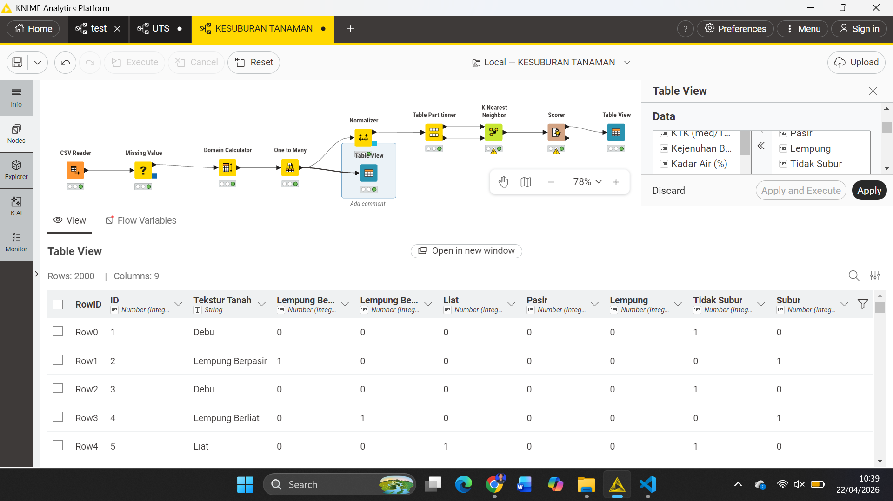
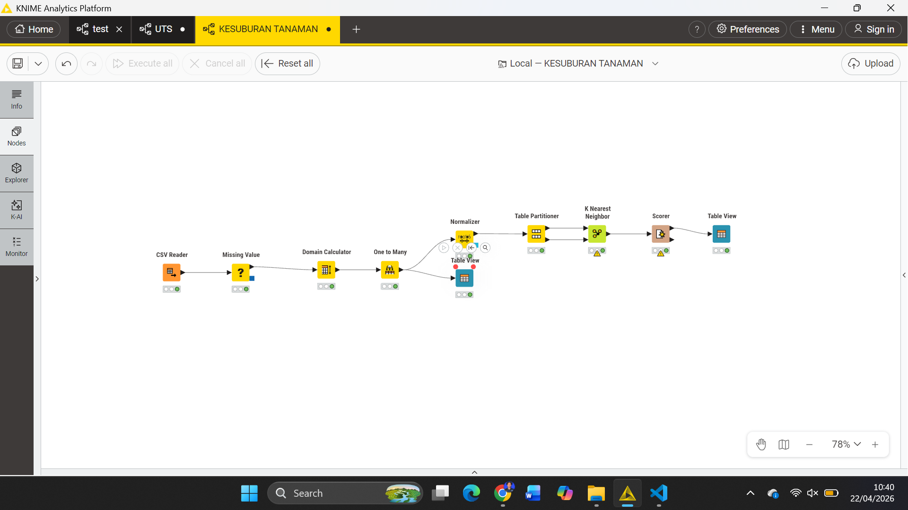
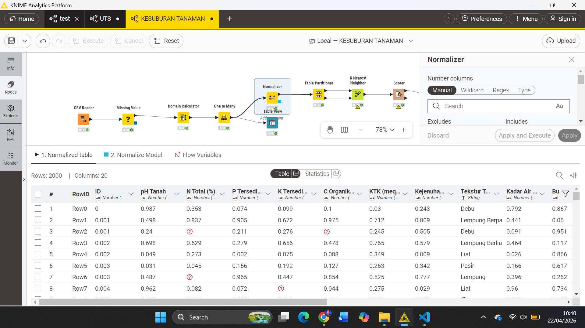
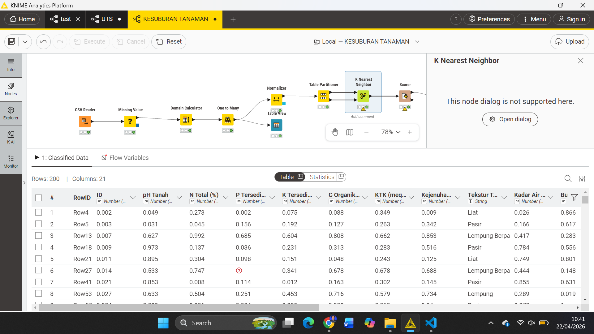
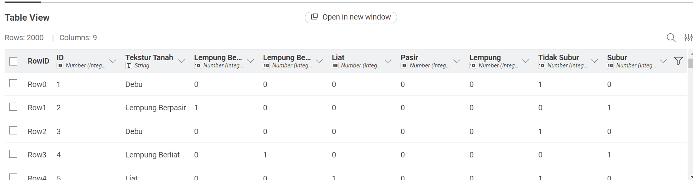
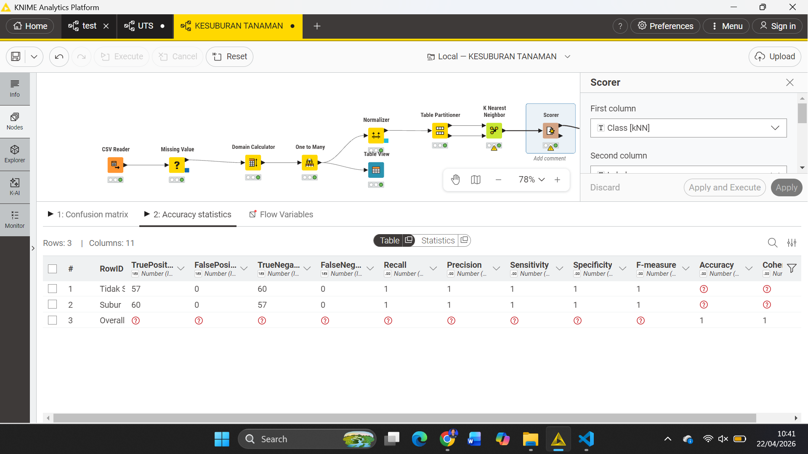
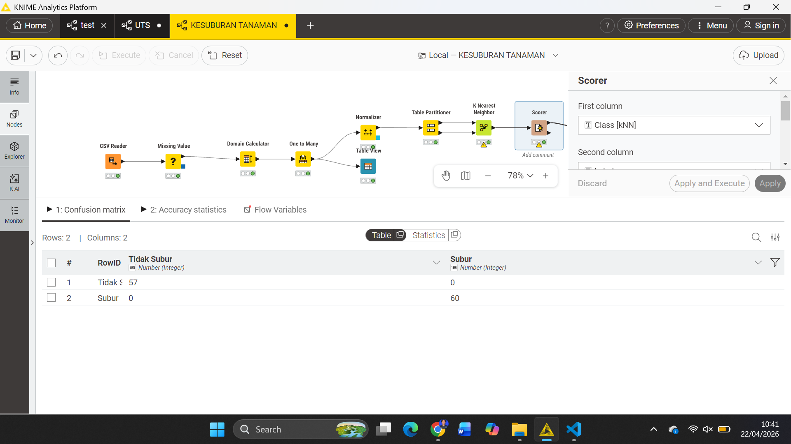

---
jupytext:
  formats: md:myst
  text_representation:
    extension: .md
    format_name: myst
    format_version: 0.13
    jupytext_version: 1.11.5
kernelspec:
  display_name: Python 3
  language: python
  name: python3
---

# UTS DATASET KLASIFIKASI KESUBURAN TANAH

## Dataset Kesuburan Tanah

Dataset yang digunakan dalam penelitian ini merupakan dataset klasifikasi kesuburan tanah yang terdiri dari **2.000 sampel data**. Setiap sampel merepresentasikan kondisi tanah berdasarkan berbagai parameter fisik dan kimia yang berpengaruh terhadap tingkat kesuburan.

Tujuan utama dari analisis ini adalah untuk mengelompokkan tanah ke dalam dua kategori, yaitu:
- **Subur**
- **Tidak Subur**

Proses klasifikasi dilakukan menggunakan algoritma **K-Nearest Neighbors (KNN)**, yaitu metode berbasis jarak yang menentukan label suatu data berdasarkan kedekatannya dengan data lain yang sudah diketahui kelasnya.

Dalam konteks ini, semakin dekat suatu data dengan data lain yang berlabel "Subur", maka kemungkinan besar data tersebut juga termasuk dalam kategori "Subur", dan begitu pula sebaliknya.

---

## Atribut Yang Digunakan

Dataset ini memiliki beberapa atribut yang digunakan sebagai dasar dalam proses klasifikasi:

| Atribut         | Tipe Data    | Keterangan                                      |
|-----------------|-------------|-------------------------------------------------|
| pH Tanah        | Numerik     | Skala keasaman tanah (0–14)                     |
| N Total         | Numerik     | Kandungan Nitrogen dalam persen (%)             |
| P Tersedia      | Numerik     | Kandungan Fosfor dalam ppm                      |
| Tekstur Tanah   | Kategorikal | Lempung, Pasir, Debu, dll.                      |
| C-Organik       | Numerik     | Kandungan karbon organik (%)                    |
| K Tersedia      | Numerik     | Kandungan Kalium dalam ppm                      |
| Kelembapan      | Numerik     | Tingkat kelembapan tanah (%)                    |
| Suhu Tanah      | Numerik     | Suhu tanah dalam derajat Celcius (°C)           |
| Drainase        | Kategorikal | Baik, Sedang, Buruk                            |
| Kedalaman Tanah | Numerik     | Kedalaman efektif tanah (cm)                    |
| Label           | Target      | Subur / Tidak Subur                             |

Setiap atribut memiliki peran penting dalam menentukan kondisi tanah. Misalnya:
- **pH Tanah** mempengaruhi ketersediaan unsur hara
- **C-Organik** menunjukkan kesuburan biologis tanah
- **Kelembapan & Drainase** mempengaruhi pertumbuhan tanaman

---

## Transformasi Data Numerik (Min-Max)

Sebelum dilakukan perhitungan jarak menggunakan KNN, seluruh data numerik harus melalui proses **normalisasi**.

Hal ini dilakukan karena setiap atribut memiliki skala yang berbeda. Contohnya:
- pH memiliki rentang kecil (0–14)
- P Tersedia bisa mencapai ribuan (ppm)

Jika tidak dinormalisasi, atribut dengan nilai besar akan mendominasi perhitungan jarak.

Oleh karena itu digunakan **Min-Max Normalization** untuk menyamakan skala ke rentang **0 sampai 1**.

---

### Contoh Perhitungan Manual (Data 1 vs Data 2)

Atribut: **pH Tanah**

- Data 1 = 8.93  
- Data 2 = 6.24  
- Nilai minimum = 3.50  
- Nilai maksimum = 9.00  

**Normalisasi Data 1:**
$$
z_1 = \frac{8.93 - 3.50}{9.00 - 3.50} = 0.987
$$

**Normalisasi Data 2:**
$$
z_2 = \frac{6.24 - 3.50}{9.00 - 3.50} = 0.498
$$

Dari hasil tersebut terlihat bahwa:
- Data 1 memiliki nilai lebih tinggi (lebih dekat ke maksimum)
- Data 2 berada di tengah rentang

---

## Transformasi Data Kategorikal

Tidak semua data berbentuk angka. Beberapa atribut seperti:
- **Tekstur Tanah**
- **Drainase**

bersifat kategorikal.

Karena algoritma KNN hanya bisa menghitung jarak numerik, maka data kategorikal harus diubah menjadi angka menggunakan metode:

### **One-Hot Encoding (One to Many)**

Metode ini mengubah satu kategori menjadi beberapa kolom biner (0 dan 1).

### Contoh:

| Tekstur | Debu | Lempung | Pasir |
|--------|------|--------|------|
| Debu   | 1    | 0      | 0    |
| Lempung| 0    | 1      | 0    |

Konsep jaraknya:
- Jika sama → jarak = 0  
- Jika berbeda → jarak = 1  

Hal ini memungkinkan data kategorikal ikut dihitung dalam Euclidean Distance.

---

## Perhitungan Jarak Euclidean

Setelah semua data berbentuk numerik (hasil normalisasi dan encoding), langkah berikutnya adalah menghitung jarak antar data.

Metode yang digunakan adalah:

### **Euclidean Distance**

Metode ini menghitung jarak lurus antar dua titik dalam ruang multidimensi.

### Contoh:

| Data   | pH | N Total | Tekstur |
|--------|----|--------|--------|
| Data 1 |0.987|0.150|1|
| Data 2 |0.498|0.420|0|

### Perhitungan:

$$
d(1,2) = \sqrt{(0.987 - 0.498)^2 + (0.150 - 0.420)^2 + (1 - 0)^2 + ...}
$$

Hasil dari perhitungan ini adalah nilai jarak yang menunjukkan tingkat kemiripan:
- Jarak kecil → sangat mirip
- Jarak besar → tidak mirip

---

## Implementasi KNIME

Untuk mempermudah proses analisis, digunakan tools **KNIME Analytics Platform**.

KNIME memungkinkan pembuatan workflow berbasis node sehingga proses data mining menjadi lebih visual dan sistematis.

---

### Alur Kerja (Workflow) Node

| Node                | Kegunaan                                                                 | Output / Hasil                                      |
|---------------------|-------------------------------------------------------------------------|----------------------------------------------------|
| CSV Reader          | Membaca file dataset                                                    | Data mentah (Raw Data)                             |
| Missing Value       | Menangani data kosong                                                   | Dataset bersih                                     |
| One to Many         | Encoding data kategorikal                                               | Data numerik                                       |
| Normalizer          | Normalisasi Min-Max                                                     | Data skala 0–1                                     |
| Partitioning        | Membagi data train 90 % & test      10%                                         | Data training & testing                            |
| K-Nearest Neighbor  | Proses klasifikasi                                                     | Hasil prediksi                                     |
| Scorer              | Evaluasi model                                                         | Confusion Matrix & Akurasi                         |

---

## Detail Proses Utama

### A. Normalizer

Tahap ini memastikan semua atribut memiliki skala yang sama.

Tanpa normalisasi:
- Nilai besar mendominasi
- Hasil KNN menjadi bias

Dengan normalisasi:
- Semua fitur memiliki kontribusi yang seimbang

---

### B. K-Nearest Neighbor (KNN)

Pada tahap ini dilakukan klasifikasi dengan menentukan nilai **k = 5**.

Artinya:
- Sistem akan melihat **5 tetangga terdekat**
- Label ditentukan berdasarkan mayoritas tetangga

Contoh:
- 3 tetangga = Subur
- 2 tetangga = Tidak Subur  
→ Maka hasil = **Subur**

---

### C. Scorer (Evaluasi Model)

Tahap terakhir adalah evaluasi performa model.

Digunakan Confusion Matrix yang terdiri dari:
- True Positive (TP)
- True Negative (TN)
- False Positive (FP)
- False Negative (FN)

Dari nilai tersebut dihitung:
- Accuracy
- Precision
- Recall
- F1-Score

Hasil menunjukkan akurasi mencapai **100%**, yang berarti model mampu mengklasifikasikan seluruh data dengan benar.

---

## Kesimpulan

Berdasarkan seluruh proses yang dilakukan:

1. Normalisasi sangat penting untuk algoritma berbasis jarak
2. Data kategorikal harus diubah ke numerik
3. KNN efektif untuk klasifikasi berbasis kemiripan
4. Pemilihan nilai k mempengaruhi hasil
5. Model menunjukkan performa sangat baik dengan akurasi tinggi

Dengan demikian, metode KNN dapat digunakan sebagai solusi dalam klasifikasi kesuburan tanah secara efektif dan akurat.